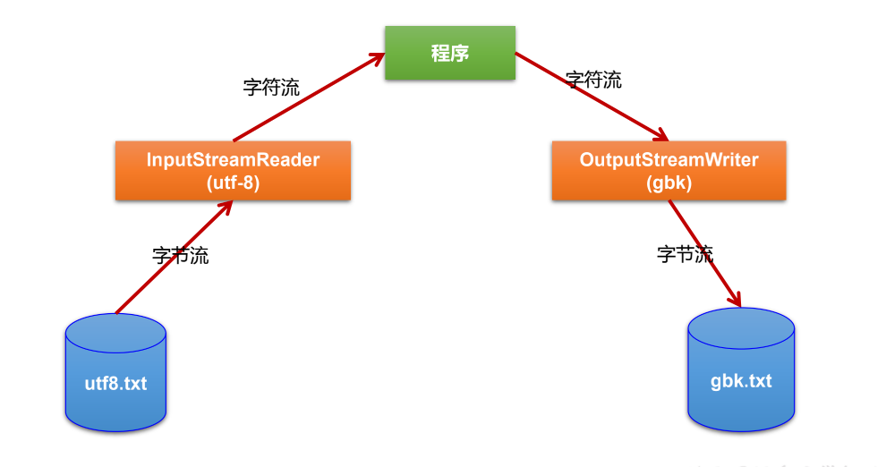

# 转换流
* 转换流提供了在字节流和字符流之间的转换
* Java API提供了两个转换流：
    > InputStreamReader：将InputStream转换为Reader  
    > OutputStreamWriter：将Writer转换为OutputStream  
*  字节流中的数据都是字符时，转成字符流操作更高效。 *  很多时候我们使用转换流来处理文件乱码问题。实现编码和解码的功能。

## InputStreamReader
* 实现将字节的输入流按指定字符集转换为字符的输入流。
* 需要和InputStream“套接”。
* 构造器
    > `public InputStreamReader(InputStream in)`  
    > `public InputSreamReader(InputStream in,String charsetName)`  

## OutputStreamWriter
* 实现将字符的输出流按指定字符集转换为字节的输出流。
* 需要和OutputStream“套接”。
* 构造器 
    > `public OutputStreamWriter(OutputStream out)`  
    > `public OutputSreamWriter(OutputStream out,String charsetName)`  

