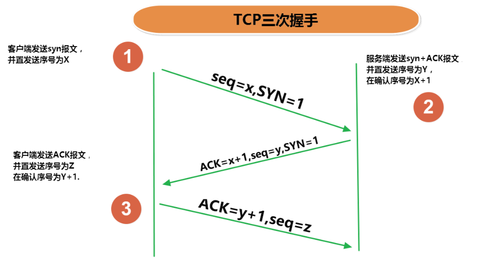
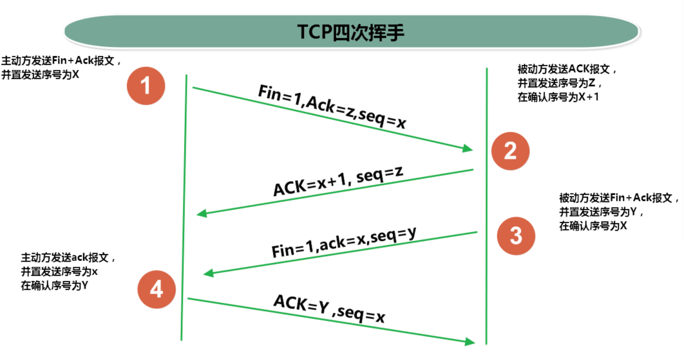

# 网络编程

## 网络通信协议 


网络编程中的两个要素：
 * IP和端口号
 * 提供网络通信协议：TCP/IP参考模型（应用层、传输层、网络层、物理+数据链路层）

## InetAddress 类
* InetAddress类没有提供公共的构造器，而是提供了如下几个静态方法来获取InetAddress实例
    > `public static InetAddress getLocalHost()`  
    > `public static InetAddress getByName(String host)`  
* InetAddress提供了如下几个常用的方法
    > `public String getHostAddress()`：返回 IP 地址字符串（以文本表现形式）  
    > `public String getHostName()`：获取此 IP 地址的主机名  
    > `public boolean isReachable(int timeout)`：测试是否可以达到该地址  

```java
public class InetAddressTest {
    public static void main(String[] args) {
        try {
            //File file = new File("hello.txt");
            InetAddress inet1 = InetAddress.getByName("192.168.10.14");
            System.out.println(inet1);

            InetAddress inet2 = InetAddress.getByName("blog.zhaojq.top");
            System.out.println(inet2);

            InetAddress inet3 = InetAddress.getByName("127.0.0.1");
            System.out.println(inet3);

            //获取本地ip
            InetAddress inet4 = InetAddress.getLocalHost();
            System.out.println(inet4);

            //getHostName()
            System.out.println(inet2.getHostName());
            //getHostAddress()
            System.out.println(inet2.getHostAddress());

        } catch (UnknownHostException e) {
            e.printStackTrace();
        }
    }
}
```

## 网络协议
* 网络通信协议  
计算机网络中实现通信必须有一些约定，即通信协议，对速率、传输代码、代码结构、传输控制步骤、出错控制等制定标准。 
* 问题：网络协议太复杂  
计算机网络通信涉及内容很多，比如指定源地址和目标地址，加密解密，压缩解压缩，差错控制，流量控制，路由控制，如何实现如此复杂的网络协议呢？ 
* 通信协议分层的思想  
在制定协议时，把复杂成份分解成一些简单的成份，再将它们复合起来。最常用的复合方式是层次方式，即同层间可以通信、上一层可以调用下一层，而与再下一层不发生关系。各层互不影响，利于系统的开发和扩展

### TCP/IP协议簇
* 传输层协议中有两个非常重要的协议：
    > 传输控制协议TCP(Transmission Control Protocol)  
    > 用户数据报协议UDP(User Datagram Protocol)。 
* TCP/IP 以其两个主要协议：传输控制协议(TCP)和网络互联协议(IP)而得名，实际上是一组协议，包括多个具有不同功能且互为关联的协议。  
* IP(Internet Protocol)协议是网络层的主要协议，支持网间互连的数据通信。
* TCP/IP协议模型从更实用的角度出发，形成了高效的四层体系结构，即物理链路层、IP层、传输层和应用层

### TCP和UDP
*  TCP协议：
    > 使用TCP协议前，须先建立TCP连接，形成传输数据通道  
    > 传输前，采用“三次握手”方式，点对点通信，是可靠的  
    > TCP协议进行通信的两个应用进程：客户端、服务端   
    > 在连接中可进行大数据量的传输  
    > 传输完毕，需释放已建立的连接，效率低  
*  UDP协议：
    > 将数据、源、目的封装成数据包，不需要建立连接  
    > 每个数据报的大小限制在64K内 > 发送不管对方是否准备好，接收方收到也不确认，故是不可靠的   
    > 可以广播发送    
    > 发送数据结束时无需释放资源，开销小，速度快    




### Socket
* 利用套接字(Socket)开发网络应用程序早已被广泛的采用，以至于成为事实上的标准。 
* 网络上具有唯一标识的IP地址和端口号组合在一起才能构成唯一能识别的标识符套接字。 
* 通信的两端都要有Socket，是两台机器间通信的端点。 
* 网络通信其实就是Socket间的通信。
* Socket允许程序把网络连接当成一个流，数据在两个Socket间通过IO传输。
* 一般主动发起通信的应用程序属客户端，等待通信请求的为服务端。
* Socket分类：
    > 流套接字（stream socket）：使用TCP提供可依赖的字节流服务  
    > 数据报套接字（datagram socket）：使用UDP提供“尽力而为”的数据报服务  

* Socket类的常用构造器： 
    > `public Socket(InetAddress address,int port)`创建一个流套接字并将其连接到指定 IP 地址的指定端口号。   
    > `public Socket(String host,int port)`创建一个流套接字并将其连接到指定主机上的指定端口号。     
* Socket类的常用方法：
    > `public InputStream getInputStream()`返回此套接字的输入流。可以用于接收网络消息  
    > `public OutputStream getOutputStream()`返回此套接字的输出流。可以用于发送网络消息  
    > `public InetAddress getInetAddress()`此套接字连接到的远程 IP 地址；如果套接字是未连接的，则返回 null。   
    > `public InetAddress getLocalAddress()`获取套接字绑定的本地地址。 即本端的IP地址  
    > `public int getPort()`此套接字连接到的远程端口号；如果尚未连接套接字，则返回 0。   
    > `public int getLocalPort()`返回此套接字绑定到的本地端口。 如果尚未绑定套接字，则返回 -1。即本端的端口号。     
    > `public void close()`关闭此套接字。套接字被关闭后，便不可在以后的网络连接中使用（即无法重新连接或重新绑定）。需要创建新的套接字对象。 关闭此套接字也将会关闭该套接字的 InputStream 和
    OutputStream。    
    > `public void shutdownInput()`如果在套接字上调用 shutdownInput() 后从套接字输入流读取内容，则流将返回 EOF（文件结束符）。 即不能在从此套接字的输入流中接收任何数据。   
    > `public void shutdownOutput()`禁用此套接字的输出流。对于 TCP 套接字，任何以前写入的数据都将被发送，并且后跟 TCP 的正常连接终止序列。 如果在套接字上调用 shutdownOutput() 后写入套接字输出流，则该流将抛出 IOException。 即不能通过此套接字的输出流发送任何数据。  

## TCP网络编程(基于socket)
* 客户端Socket的工作过程包含以下四个基本的步骤： 
    > 创建 Socket：根据指定服务端的 IP 地址或端口号构造 Socket 类对象。若服务器端响应，则建立客户端到服务器的通信线路。若连接失败，会出现异常    
    > 打开连接到 Socket 的输入/出流： 使用 `getInputStream()`方法获得输入流，使用`getOutputStream()`方法获得输出流，进行数据传输    
    > 按照一定的协议对 Socket 进行读/写操作：通过输入流读取服务器放入线路的信息（但不能读取自己放入线路的信息），通过输出流将信息写入线程    
    > 关闭 Socket：断开客户端到服务器的连接，释放线路  

* 服务器程序的工作过程包含以下四个基本的步骤：
    > 调用 `ServerSocket(int port)` ：创建一个服务器端套接字，并绑定到指定端口上。用于监听客户端的请求。    
    > 调用 `accept()`：监听连接请求，如果客户端请求连接，则接受连接，返回通信套接字对象。     
    > 调用 该Socket类对象的 `getOutputStream()` 和 `getInputStream ()`：获取输出流和输入流，开始网络数据的发送和接收。    
    > 关闭ServerSocket和Socket对象：客户端访问结束，关闭通信套接字。      

```java
/**
 * 实现TCP的网络编程
 * 例子1：客户端发送信息给服务端，服务端将数据显示在控制台上
 */
public class TCPTest1 {
    //客户端
    @Test
    public void client()  {
        Socket socket = null;
        OutputStream os = null;
        try {
            //1.创建Socket对象，指明服务器端的ip和端口号
            InetAddress inet = InetAddress.getByName("127.0.0.1");
            socket = new Socket(inet,8899);
            //2.获取一个输出流，用于输出数据
            os = socket.getOutputStream();
            //3.写出数据的操作
            os.write("你好，我是客户端mm".getBytes());
        } catch (IOException e) {
            e.printStackTrace();
        } finally {
            //4.资源的关闭
            if(os != null){
                try {
                    os.close();
                } catch (IOException e) {
                    e.printStackTrace();
                }

            }
            if(socket != null){
                try {
                    socket.close();
                } catch (IOException e) {
                    e.printStackTrace();
                }

            }
        }
    }
    //服务端
    @Test
    public void server()  {
        ServerSocket ss = null;
        Socket socket = null;
        InputStream is = null;
        ByteArrayOutputStream baos = null;
        try {
            //1.创建服务器端的ServerSocket，指明自己的端口号
            ss = new ServerSocket(8899);
            //2.调用accept()表示接收来自于客户端的socket
            socket = ss.accept();
            //3.获取输入流
            is = socket.getInputStream();

            //不建议这样写，可能会有乱码
//        byte[] buffer = new byte[1024];
//        int len;
//        while((len = is.read(buffer)) != -1){
//            String str = new String(buffer,0,len);
//            System.out.print(str);
//        }
            //4.读取输入流中的数据
            baos = new ByteArrayOutputStream();
            byte[] buffer = new byte[5];
            int len;
            while((len = is.read(buffer)) != -1){
                baos.write(buffer,0,len);
            }
            System.out.println(baos.toString());
            System.out.println("收到了来自于：" + socket.getInetAddress().getHostAddress() + "的数据");

        } catch (IOException e) {
            e.printStackTrace();
        } finally {
            if(baos != null){
                //5.关闭资源
                try {
                    baos.close();
                } catch (IOException e) {
                    e.printStackTrace();
                }
            }
            if(is != null){
                try {
                    is.close();
                } catch (IOException e) {
                    e.printStackTrace();
                }
            }
            if(socket != null){
                try {
                    socket.close();
                } catch (IOException e) {
                    e.printStackTrace();
                }
            }
            if(ss != null){
                try {
                    ss.close();
                } catch (IOException e) {
                    e.printStackTrace();
                }
            }
        }
    }
}
```

## UDP网络编程(基于socket)
* 类 DatagramSocket 和 DatagramPacket 实现了基于 UDP 协议网络程序。
* UDP数据报通过数据报套接字 DatagramSocket 发送和接收，系统不保证UDP数据报一定能够安全送到目的地，也不能确定什么时候可以抵达。
* DatagramPacket 对象封装了UDP数据报，在数据报中包含了发送端的IP地址和端口号以及接收端的IP地址和端口号。
* UDP协议中每个数据报都给出了完整的地址信息，因此无须建立发送方和接收方的连接。如同发快递包裹一样。

### DatagramSocket常用方法
* `public DatagramSocket(int port)`创建数据报套接字并将其绑定到本地主机上的指定端口。套接字将被绑定到通配符地址，IP 地址由内核来选择。 
* `public DatagramSocket(int port,InetAddress laddr)`创建数据报套接字，将其绑定到指定的本地地址。本地端口必须在 0 到 65535 之间（包括两者）。如果 IP 地址为 0.0.0.0，套接字将被绑定到通配符地址，IP 地址由内核选择。 
* `public void close()`关闭此数据报套接字。 
* `public void send(DatagramPacket p)`从此套接字发送数据报包。DatagramPacket 包含的信息指示：将要发送的数据、其长度、远程主机的 IP 地址和远程主机的端口号。 
* `public void receive(DatagramPacket p)`从此套接字接收数据报包。当此方法返回时，DatagramPacket的缓冲区填充了接收的数据。数据报包也包含发送方的 IP 地址和发送方机器上的端口号。 此方法
在接收到数据报前一直阻塞。数据报包对象的 length 字段包含所接收信息的长度。如果信息比包的长度长，该信息将被截短。 
* `public InetAddress getLocalAddress()`获取套接字绑定的本地地址。 
* `public int getLocalPort()`返回此套接字绑定的本地主机上的端口号。 
* `public InetAddress getInetAddress()`返回此套接字连接的地址。如果套接字未连接，则返回 null。 
* `public int getPort()`返回此套接字的端口。如果套接字未连接，则返回 -1

### DatagramPacket常用方法
* `public DatagramPacket(byte[] buf,int length)`构造 DatagramPacket，用来接收长度为 length 的数据包。 length 参数必须小于等于 buf.length。 
* `public DatagramPacket(byte[] buf,int length,InetAddress address,int port)`构造数据报包，用来将长度为 length 的包发送到指定主机上的指定端口号。length参数必须小于等于 buf.length。 
* `public InetAddress getAddress()`返回某台机器的 IP 地址，此数据报将要发往该机器或者是从该机器接收到的。 
* `public int getPort()`返回某台远程主机的端口号，此数据报将要发往该主机或者是从该主机接收到的。 
* `public byte[] getData()`返回数据缓冲区。接收到的或将要发送的数据从缓冲区中的偏移量 offset 处开始，持续 length 长度。 
* `public int getLength()`返回将要发送或接收到的数据的长度。

```java
/**
 * UDPd协议的网络编程
 */
public class UDPTest {
    //发送端
    @Test
    public void sender() throws IOException {
        DatagramSocket socket = new DatagramSocket();
        String str = "我是UDP方式发送的导弹";
        byte[] data = str.getBytes();
        InetAddress inet = InetAddress.getLocalHost();
        DatagramPacket packet = new DatagramPacket(data,0,data.length,inet,9090);
        socket.send(packet);
        socket.close();

    }
    //接收端
    @Test
    public void receiver() throws IOException {
        DatagramSocket socket = new DatagramSocket(9090);
        byte[] buffer = new byte[100];
        DatagramPacket packet = new DatagramPacket(buffer,0,buffer.length);
        socket.receive(packet);
        System.out.println(new String(packet.getData(),0,packet.getLength()));
        socket.close();
    }
}
```

## URL类
* URL(Uniform Resource Locator)：统一资源定位符，它表示 Internet 上某一资源的地址
* <传输协议>://<主机名>:<端口号>/<文件名>#片段名?参数列表

### 构造器
* `public URL (String spec)`：通过一个表示URL地址的字符串可以构造一个URL对象。例如：`URL url = new URL ("http://blog.zhaojq.top")`; 
* `public URL(URL context, String spec)`：通过基 URL 和相对 URL 构造一个 URL 对象。例如：`URL downloadUrl = new URL(url, “download.html")`
* `public URL(String protocol, String host, String file)`; 例如：`new URL("http", "[blog.zhaojq.top](http://blog.zhaojq.top)", “download. html")`;
* `public URL(String protocol, String host, int port, String file)`; 例如: `URL gamelan = new URL("http", "blog.zhaojq.top", 80, “download.html")`;

### 属性
* `public String getProtocol()` 获取该URL的协议名
* `public String getHost()` 获取该URL的主机名
* `public String getPort()` 获取该URL的端口号
* `public String getPath()` 获取该URL的文件路径
* `public String getFile()` 获取该URL的文件名
* `public String getQuery()` 获取该URL的查询名
    ```java
    public class URLTest {
        public static void main(String[] args) {
            try {
                URL url = new URL("http://localhost:8080/examples/beauty.jpg?username=Tom");
    //            public String getProtocol(  )     获取该URL的协议名
                System.out.println(url.getProtocol());
    //            public String getHost(  )           获取该URL的主机名
                System.out.println(url.getHost());
    //            public String getPort(  )            获取该URL的端口号
                System.out.println(url.getPort());
    //            public String getPath(  )           获取该URL的文件路径
                System.out.println(url.getPath());
    //            public String getFile(  )             获取该URL的文件名
                System.out.println(url.getFile());
    //            public String getQuery(   )        获取该URL的查询名
                System.out.println(url.getQuery());
            } catch (MalformedURLException e) {
                e.printStackTrace();
            }
        }
    }
    ```

### 针对HTTP协议的URLConnection类
* URL的方法 openStream()：能从网络上读取数据
* 若希望输出数据，例如向服务器端的 CGI （公共网关接口-Common Gateway Interface-的简称，是用户浏览器和服务器端的应用程序进行连接的接口）程序发送一些数据，则必须先与URL建立连接，然后才能对其进行读写，此时需要使用URLConnection 。 
* URLConnection：表示到URL所引用的远程对象的连接。当与一个URL建立连接时，首先要在一个 URL 对象上通过方法 openConnection() 生成对应的 URLConnection对象。如果连接过程失败，将产生IOException. 
    > `URL netchinaren = new URL ("http://blog.zhaojq.top")`;   
    > `URLConnectonn u = netchinaren.openConnection( )`;  
* 通过URLConnection对象获取的输入流和输出流，即可以与现有的CGI程序进行交互。
    > `public Object getContent( ) throws IOException`  
    > `public int getContentLength( )`  
    > `public String getContentType( )`  
    > `public long getDate( )`  
    > `public long getLastModified( )`  
    > `public InputStream getInputStream( )throws IOException`  
    > `public OutputSteram getOutputStream( )throws IOException`  
    ```java
    public class URLTest {
        public static void main(String[] args) {
            HttpURLConnection urlConnection = null;
            InputStream is = null;
            FileOutputStream fos = null;
            try {
                URL url = new URL("http://localhost:8080/examples/beauty.jpg");
                urlConnection = (HttpURLConnection) url.openConnection();
                urlConnection.connect();
                is = urlConnection.getInputStream();
                fos = new FileOutputStream("beauty5.jpg");
                byte[] buffer = new byte[1024];
                int len;
                while ((len = is.read(buffer)) != -1) {
                    fos.write(buffer, 0, len);
                }
                System.out.println("下载完成");
            } catch (IOException e) {
                e.printStackTrace();
            } finally {
                //关闭资源
                if (is != null) {
                    try {
                        is.close();
                    } catch (IOException e) {
                        e.printStackTrace();
                    }
                }
                if (fos != null) {
                    try {
                        fos.close();
                    } catch (IOException e) {
                        e.printStackTrace();
                    }
                }
                if (urlConnection != null) {
                    urlConnection.disconnect();
                }
            }
        }
    }
    ```

### URI、URL和URN的区别
* URI，是uniform resource identifier，统一资源标识符，用来唯一的标识一个资源。
* URL是uniform resource locator，统一资源定位符，它是一种具体的URI，即URL可以用来标识一个资源，而且还指明了如何locate这个资源。
* URN，uniform resource name，统一资源命名，是通过名字来标识资源，比如mailto:java-net@java.sun.com。
* 也就是说，URI是以一种抽象的，高层次概念定义统一资源标识，而URL和URN则是具体的资源标识的方式。URL和URN都是一种URI。 在Java的URI中，一个URI实例可以代表绝对的，也可以是相对的，只要它符
合URI的语法规则。而URL类则不仅符合语义，还包含了定位该资源的信息，
因此它不能是相对的。