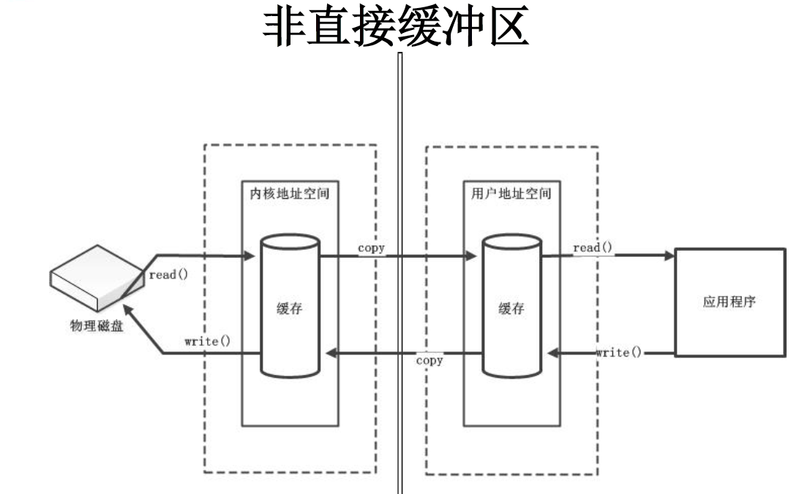
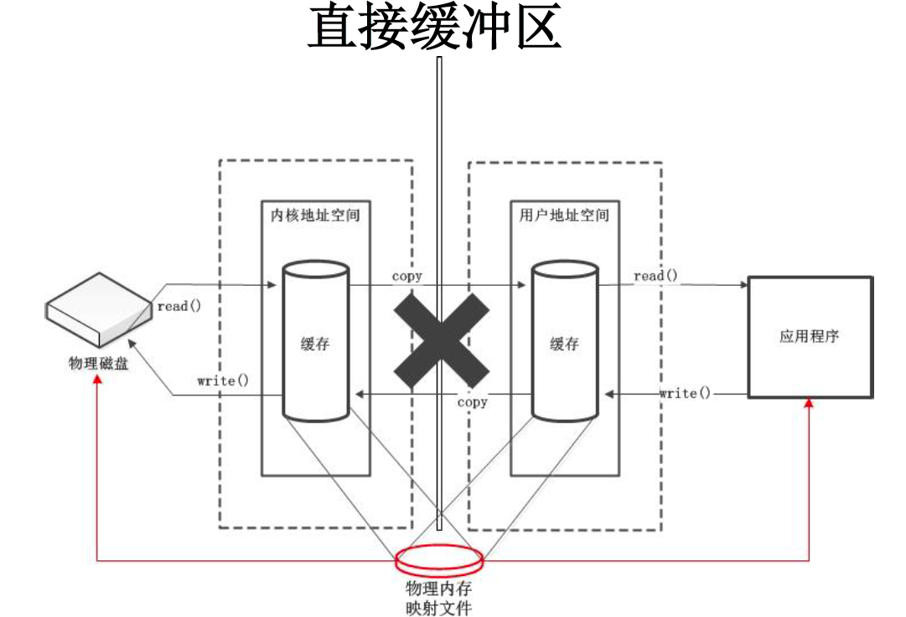

# Buffer(缓冲区)
## Buffer
在 Java NIO 中负责数据的存取。缓冲区就是数组。用于存储不同数据类型的数据
## Buffer类型
根据数据类型不同（boolean 除外），提供了相应类型的缓冲区
 * ByteBuffer
 * CharBuffer
 * ShortBuffer
 * IntBuffer
 * LongBuffer
 * FloatBuffer
 * DoubleBuffer
 通过allocate()方法获取缓冲区
## 数据存取
 * put()
 * get()
## 4个核心属性
 * capacity : 容量，表示缓冲区中最大存储数据的容量。一旦声明不能改变。
 * limit : 界限，表示缓冲区中可以操作数据的大小。（limit 后数据不能进行读写）
 * position : 位置，表示缓冲区中正在操作数据的位置。
 * mark : 标记，表示记录当前 position 的位置。可以通过 reset() 恢复到 mark 的位置  
0 <= mark <= position <= limit <= capacity

```java
public class TestBuffer {
    @Test
    public void test1(){
        String str = "abcde";
                
        //1. 分配一个指定大小的缓冲区
        ByteBuffer buf = ByteBuffer.allocate(1024);
        
        System.out.println("-----------------allocate()----------------");
        System.out.println(buf.position());//0
        System.out.println(buf.limit());//1024
        System.out.println(buf.capacity());//1024
        
        //2. 利用 put() 存入数据到缓冲区中
        buf.put(str.getBytes());
        
        System.out.println("-----------------put()----------------");
        System.out.println(buf.position());//5
        System.out.println(buf.limit());//1024
        System.out.println(buf.capacity());//1024
        
        //3. 切换读取数据模式
        buf.flip();
        
        System.out.println("-----------------flip()----------------");
        System.out.println(buf.position());//0
        System.out.println(buf.limit());//5
        System.out.println(buf.capacity());//1024
        
        //4. 利用 get() 读取缓冲区中的数据
        byte[] dst = new byte[buf.limit()];
        buf.get(dst);
        System.out.println(new String(dst, 0, dst.length));//abcde
        System.out.println("-----------------get()----------------");
        System.out.println(buf.position());//5
        System.out.println(buf.limit());//5
        System.out.println(buf.capacity());//1024
        
        //5. rewind() : 可重复读
        buf.rewind();
        
        System.out.println("-----------------rewind()----------------");
        System.out.println(buf.position());//0
        System.out.println(buf.limit());//5
        System.out.println(buf.capacity());//1024
        
        //6. clear() : 清空缓冲区. 但是缓冲区中的数据依然存在，但是处于“被遗忘”状态
        buf.clear();
        
        System.out.println("-----------------clear()----------------");
        System.out.println(buf.position());//0
        System.out.println(buf.limit());//1024
        System.out.println(buf.capacity());//1024
        System.out.println((char)buf.get());//a
    }
    
    @Test
    public void test2(){
        String str = "abcde";
        ByteBuffer buf = ByteBuffer.allocate(1024);
        buf.put(str.getBytes());
        
        buf.flip();
        
        byte[] dst = new byte[buf.limit()];
        buf.get(dst, 0, 2);
        System.out.println(new String(dst, 0, 2));//ab
        System.out.println(buf.position());//2
        
        //mark() : 标记
        buf.mark();
        
        buf.get(dst, 2, 2);
        System.out.println(new String(dst, 2, 2));//cd
        System.out.println(buf.position());//4
        
        //reset() : 恢复到 mark 的位置
        buf.reset();
        System.out.println(buf.position());//2
        
        //判断缓冲区中是否还有剩余数据
        if(buf.hasRemaining()){
            //获取缓冲区中可以操作的数量
            System.out.println(buf.remaining());//3
        }
    }

}
```
## Buffer的常用方法
| IO | NIO |
| :--- | :---|
| Buffer clear() | 清空缓冲区并返回对缓冲区的引用 |
| Buffer flip() | 将缓冲区的界限设置为当前位置，并将当前位置重置为0 |
| int capacity() | 返回Buffer 的capacity大小 |
| boolean hasRemaining() | 判断缓冲区中是否还有元素 |
| int limit() | 返回Buffer 的界限(limit) 的位置 |
| Buffer limit(int n) | 将设置缓冲区界限为n, 并返回一个具有新limit 的缓冲区对象 |
| Buffer mark() | 对缓冲区设置标记 |
| int position() | 返回缓冲区的当前位置position |
| Buffer position(int n) | 将设置缓冲区的当前位置为n , 并返回修改后的Buffer 对象 |
| int remaining() | 返回position 和limit 之间的元素个数 |
| Buffer reset() | 将位置position 转到以前设置的mark 所在的位置 |
| Buffer rewind() | 将位置设为为0，取消设置的mark |
## 直接与非直接缓冲区
 * 字节缓冲区要么是直接的，要么是非直接的。如果为直接字节缓冲区，则Java 虚拟机会尽最大努力直接在此缓冲区上执行本机I/O 操作。也就是说，在每次调用基础操作系统的一个本机I/O 操作之前（或之后），虚拟机都会尽量避免将缓冲区的内容复制到中间缓冲区中（或从中间缓冲区中复制内容）。
 * 直接字节缓冲区可以通过调用此类的allocateDirect() 工厂方法来创建。此方法返回的缓冲区进行分配和取消分配所需成本通常高于非直接缓冲区。直接缓冲区的内容可以驻留在常规的垃圾回收堆之外，因此，它们对应用程序的内存需求量造成的影响可能并不明显。所以，建议将直接缓冲区主要分配给那些易受基础系统的本机I/O 操作影响的大型、持久的缓冲区。一般情况下，最好仅在直接缓冲区能在程序性能方面带来明显好处时分配它们。
 * 直接字节缓冲区还可以通过FileChannel 的map() 方法将文件区域直接映射到内存中来创建。该方法返回MappedByteBuffer。Java 平台的实现有助于通过JNI 从本机代码创建直接字节缓冲区。如果以上这些缓冲区中的某个缓冲区实例指的是不可访问的内存区域，则试图访问该区域不会更改该缓冲区的内容，并且将会在访问期间或稍后的某个时间导致抛出不确定的异常。
 * 字节缓冲区是直接缓冲区还是非直接缓冲区可通过调用其isDirect()方法来确定。提供此方法是为了能够在性能关键型代码中执行显式缓冲区管理。
 * 非直接缓冲区：通过 allocate() 方法分配缓冲区，将缓冲区建立在 JVM 的内存中
 * 直接缓冲区：通过 allocateDirect() 方法分配直接缓冲区，将缓冲区建立在物理内存中。可以提高效率
 
 
 ```java
//分配直接缓冲区
ByteBuffer buf = ByteBuffer.allocateDirect(1024);
System.out.println(buf.isDirect());//true
```