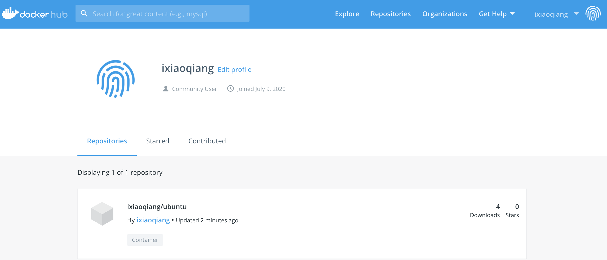

# 仓库管理

## Docker Hub

### 注册账号
[Docker Hub](https://hub.docker.com/)

### 登录
```bash
 docker login 

Login with your Docker ID to push and pull images from Docker Hub. If you don't have a Docker ID, head over to https://hub.docker.com to create one.
Username: ixiaoqiang
Password: [此处输入密码]
WARNING! Your password will be stored unencrypted in /root/.docker/config.json.
Configure a credential helper to remove this warning. See
https://docs.docker.com/engine/reference/commandline/login/#credentials-store

Login Succeeded
```

### 登出
```bash
docker logout

Removing login credentials for https://index.docker.io/v1/
```

### 推送镜像
```bash
docker push ixiaoqiang/ubuntu:1.0

The push refers to repository [docker.io/ixiaoqiang/ubuntu]
67da913fdc66: Pushed 
05f3b67ed530: Pushed 
ec1817c93e7c: Pushed 
9e97312b63ff: Pushed 
e1c75a5e0bfa: Pushed 

#等待推送完成即可
#注意: 镜像名称 和 账户名称要一致,否则禁止推送
```

此时在账户即可看到推送的镜像  

