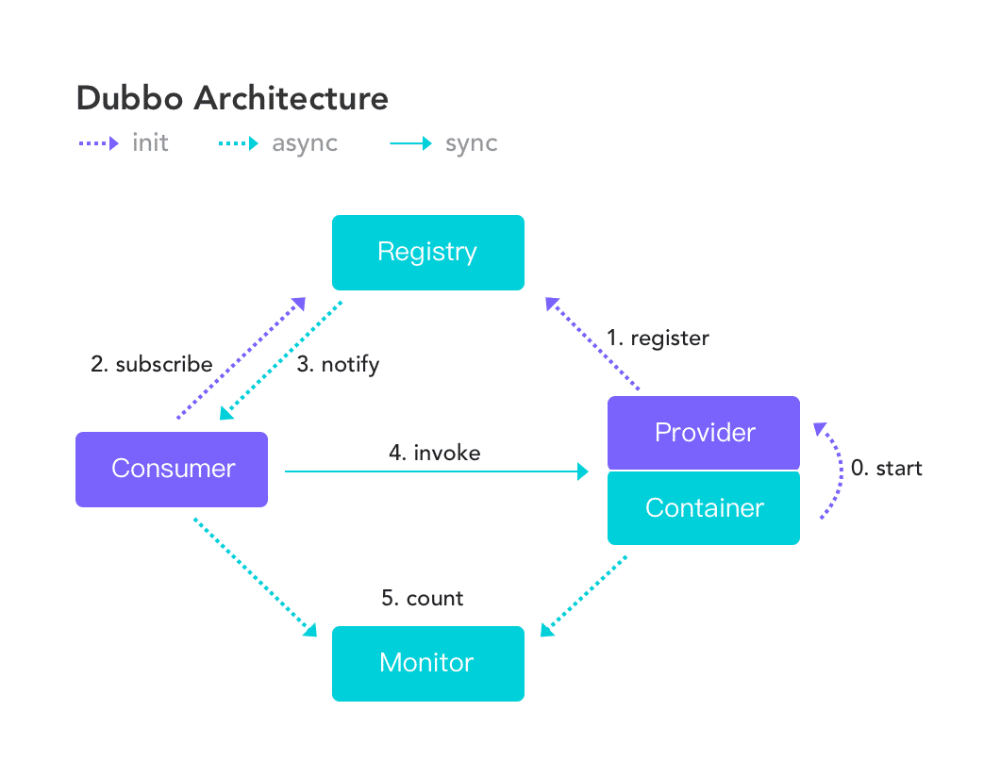
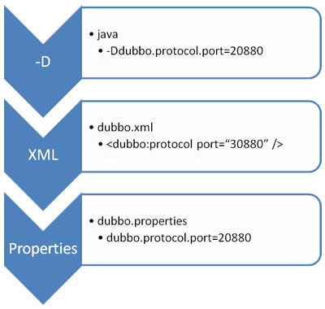
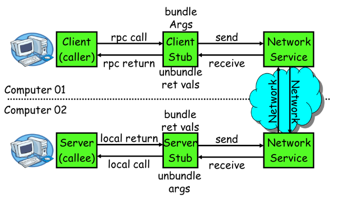
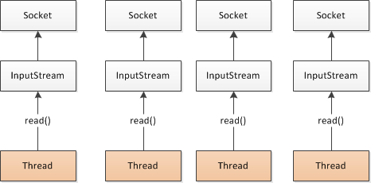
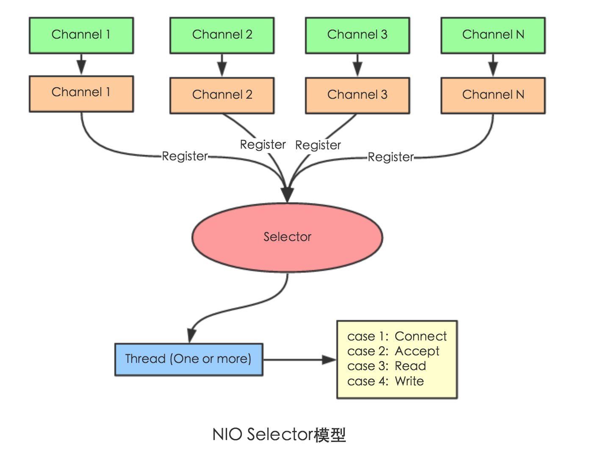
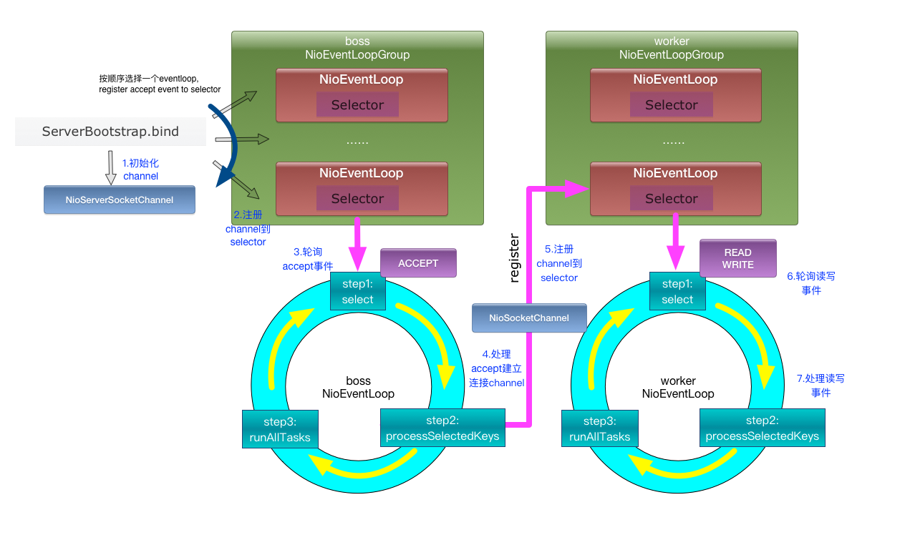
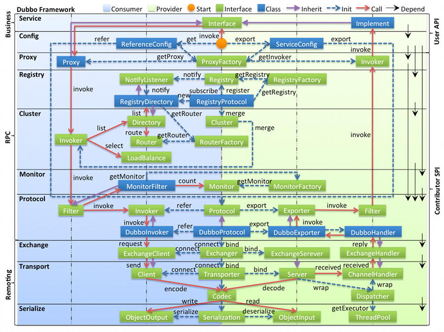
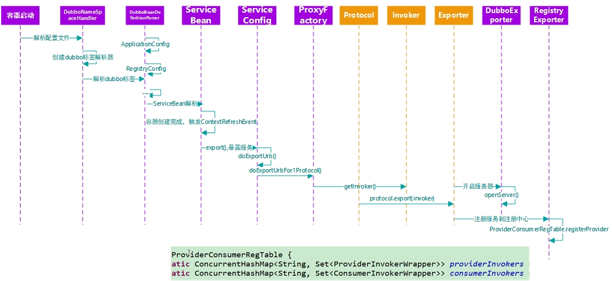
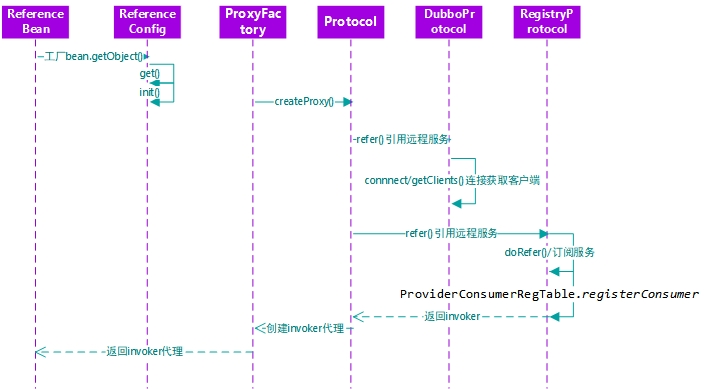
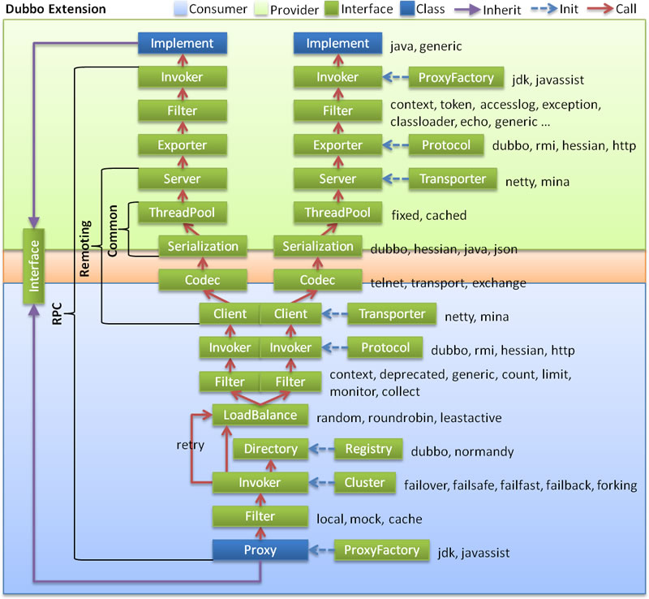

# 一.基本知识
## 1.分布式理论
什么是分布式系统?  
分布式系统是若干独立计算机的集合,这些计算机对于用户来说就像单个相关系统. 是建立在网络之上的软件系统. 需要一个治理系统确保架构有条不紊的进行.

发展演变  
单体架构 --> 垂直应用架构 --> 分布式服务架构 --> 流动计算应用架构
orm --> mvc --> rpc --> soa

RPC  远程过程调用  
client functions --> client stub --> sockets(client) --> sockets(sever) --> server stub --> server functions  

rpc核心模块: 通信, 序列化

常见rpc框架: dubbo, grpc,thrift, hsf(high speed service framework)

## 2.dubbo核心概念
Apache Dubbo (incubating) |ˈdʌbəʊ| 是一款高性能、轻量级的开源Java RPC框架，它提供了三大核心能力：面向接口的远程方法调用，智能容错和负载均衡，以及服务自动注册和发现



- 服务提供者（Provider）：暴露服务的服务提供方，服务提供者在启动时，向注册中心注册自己提供的服务。
- 服务消费者（Consumer）: 调用远程服务的服务消费方，服务消费者在启动时，向注册中心订阅自己所需的服务，服务消费者，从提供者地址列表中，基于软负载均衡算法，选一台提供者进行调用，如果调用失败，再选另一台调用。
- 注册中心（Registry）：注册中心返回服务提供者地址列表给消费者，如果有变更，注册中心将基于长连接推送变更数据给消费者
- 监控中心（Monitor）：服务消费者和提供者，在内存中累计调用次数和调用时间，定时每分钟发送一次统计数据到监控中心

调用关系说明
- 服务容器负责启动，加载，运行服务提供者。
- 服务提供者在启动时，向注册中心注册自己提供的服务。
- 服务消费者在启动时，向注册中心订阅自己所需的服务。
- 注册中心返回服务提供者地址列表给消费者，如果有变更，注册中心将基于长连接推送变更数据给消费者。
- 服务消费者，从提供者地址列表中，基于软负载均衡算法，选一台提供者进行调用，如果调用失败，再选另一台调用。
- 服务消费者和提供者，在内存中累计调用次数和调用时间，定时每分钟发送一次统计数据到监控中心

## 3.dubbo环境搭建
1.zookeeper集群搭建: 参考 zookeeper安装  
2.dubbo-admin安装: [dubbo-admin安装](https://www.cnblogs.com/chy18883701161/p/12791995.html)

## 4.dubbo-helloword
dubblo-admin: 启动dubblo-admin-server下的jar包

# 二.dubblo配置
- dubbo:service: 服务提供者暴露服务配置.对应的配置类：org.apache.dubbo.config.ServiceConfig
- dubbo:reference: 服务消费者引用服务配置.对应的配置类： org.apache.dubbo.config.ReferenceConfig
- dubbo:protocol: 服务提供者协议配置.对应的配置类： org.apache.dubbo.config.ProtocolConfig
- dubbo:registry: 注册中心配置.对应的配置类： org.apache.dubbo.config.RegistryConfig
- dubbo:monitor: 监控中心配置.对应的配置类： org.apache.dubbo.config.MonitorConfig
- dubbo:application: 应用中心配置.对应的配置类：org.apache.dubbo.config.ApplicationConfig
- dubbo:module: 模块中心配置.对应的配置类 org.apache.dubbo.config.ModuleConfig
- dubbo:provider: 服务提供者缺省配置.对应的配置类： org.apache.dubbo.config.ProviderConfig
- dubbo:consumer: 服务消费者缺省配置.配置类： org.apache.dubbo.config.ConsumerConfig
- dubbo:method: 方法级配置.对应的配置类： org.apache.dubbo.config.MethodConfig
- dubbo:argument: 方法参数配置.对应的配置类： org.apache.dubbo.config.ArgumentConfig
- dubbo:parameter: 选项参数配置
- dubbo:config: 配置中心.对应的配置类：org.apache.dubbo.config.ConfigCenterConfig

## 1.配置覆盖关系
以 timeout 为例，下图显示了配置的查找顺序，其它 retries, loadbalance, actives 等类似：

- 方法级优先，接口级次之，全局配置再次之。
- 如果级别一样，则消费方优先，提供方次之。
  
其中，服务提供方配置，通过 URL 经由注册中心传递给消费方。


**属性重写与优先级**


**配置原则**
- 1、作服务的提供者，比服务使用方更清楚服务性能参数，如调用的超时时间，合理的重试次数，等等
- 2、在Provider配置后，Consumer不配置则会使用Provider的配置值，即Provider配置可以作为Consumer的缺省值。否则，Consumer会使用Consumer端的全局设置，这对于Provider不可控的，并且往往是不合理的

## 2.启动时检查
### 通过 spring 配置文件
关闭某个服务的启动时检查 (没有提供者时报错)：
```xml
<dubbo:reference interface="com.foo.BarService" check="false" />
```

关闭所有服务的启动时检查 (没有提供者时报错)：
```xml
<dubbo:consumer check="false" />
```

关闭注册中心启动时检查 (注册订阅失败时报错)：
```xml
<dubbo:registry check="false" />
```
### 通过dubbo.properties
```properties
dubbo.reference.com.foo.BarService.check=false
dubbo.reference.check=false
dubbo.consumer.check=false
dubbo.registry.check=false
```

### 通过-D参数
```
java -Ddubbo.reference.com.foo.BarService.check=false
java -Ddubbo.reference.check=false
java -Ddubbo.consumer.check=false 
java -Ddubbo.registry.check=false
```

## 3.配置超时
```
timeout="5000" 单位ms, 尽量在provider端配置,运行时,服务端更清楚,这样消费端调用多个服务,无需关心服务或者方法的超时时间
```

## 4.重试次数
retries="3" 不包含首次调用

## 5.多版本
当一个接口实现，出现不兼容升级时，可以用版本号过渡，版本号不同的服务相互间不引用。

可以按照以下的步骤进行版本迁移：

在低压力时间段，先升级一半提供者为新版本
再将所有消费者升级为新版本
然后将剩下的一半提供者升级为新版本
老版本服务提供者配置：

<dubbo:service interface="com.foo.BarService" version="1.0.0" />
新版本服务提供者配置：

<dubbo:service interface="com.foo.BarService" version="2.0.0" />
老版本服务消费者配置：

<dubbo:reference id="barService" interface="com.foo.BarService" version="1.0.0" />
新版本服务消费者配置：

<dubbo:reference id="barService" interface="com.foo.BarService" version="2.0.0" />
如果不需要区分版本，可以按照以下的方式配置 [1]：

<dubbo:reference id="barService" interface="com.foo.BarService" version="*" />

## 6.本地存根

远程服务后，客户端通常只剩下接口，而实现全在服务器端，但提供方有些时候想在客户端也执行部分逻辑，比如：做 ThreadLocal 缓存，提前验证参数，调用失败后伪造容错数据等等，此时就需要在 API 中带上 Stub，客户端生成 Proxy 实例，会把 Proxy 通过构造函数传给 Stub [1]，然后把 Stub 暴露给用户，Stub 可以决定要不要去调 Proxy
`<dubbo:service interface="com.foo.BarService" stub="true" />`  
`<dubbo:service interface="com.foo.BarService" stub="com.foo.BarServiceStub" />`  

```java
package com.foo;
public class BarServiceStub implements BarService {
    private final BarService barService;
    
    // 构造函数传入真正的远程代理对象, 必须要有构造函数
    public BarServiceStub(BarService barService){
        this.barService = barService;
    }
 
    public String sayHello(String name) {
        // 此代码在客户端执行, 你可以在客户端做ThreadLocal本地缓存，或预先验证参数是否合法，等等
        try {
            return barService.sayHello(name);
        } catch (Exception e) {
            // 你可以容错，可以做任何AOP拦截事项
            return "容错数据";
        }
    }
}
```

## 7.SpringBoot与dubbo整合的三种方式：
 * 1）导入dubbo-starter，在application.properties配置属性，使用@Service【暴露服务】使用@Reference【引用服务】
 * 2）保留dubbo xml配置文件;  
    导入dubbo-starter，使用@ImportResource导入dubbo的配置文件即可
 * 3) 使用注解API的方式：  
    将每一个组件手动创建到容器中,让dubbo来扫描其他的组件


# 三. 高可用
高可用：通过设计，减少系统不能提供服务的时间
## zookeeper宕机与dubbo直连
现象：zookeeper注册中心宕机，还可以消费dubbo暴露的服务
```
原因: 健壮性
- 监控中心宕掉不影响使用，只是丢失部分采样数据
- 数据库宕掉后，注册中心仍能通过缓存提供服务列表查询，但不能注册新服务
- 注册中心对等集群，任意一台宕掉后，将自动切换到另一台
- 注册中心全部宕掉后，服务提供者和服务消费者仍能通过本地缓存通讯
- 服务提供者无状态，任意一台宕掉后，不影响使用
- 服务提供者全部宕掉后，服务消费者应用将无法使用，并无限次重连等待服务提供者恢复
```

dubbo直连: @reference(url="ip:port")

## 负载均衡策略
public interface LoadBalance 接口
- Random LoadBalance
随机，按权重设置随机概率。
在一个截面上碰撞的概率高，但调用量越大分布越均匀，而且按概率使用权重后也比较均匀，有利于动态调整提供者权重。
- RoundRobin LoadBalance
轮循，按公约后的权重设置轮循比率。
存在慢的提供者累积请求的问题，比如：第二台机器很慢，但没挂，当请求调到第二台时就卡在那，久而久之，所有请求都卡在调到第二台上。
- LeastActive LoadBalance
最少活跃调用数，相同活跃数的随机，活跃数指调用前后计数差。
使慢的提供者收到更少请求，因为越慢的提供者的调用前后计数差会越大。
- ConsistentHash LoadBalance
一致性 Hash，相同参数的请求总是发到同一提供者。
当某一台提供者挂时，原本发往该提供者的请求，基于虚拟节点，平摊到其它提供者，不会引起剧烈变动。算法参见：http://en.wikipedia.org/wiki/Consistent_hashing
缺省只对第一个参数 Hash，如果要修改，请配置 <dubbo:parameter key="hash.arguments" value="0,1" />
缺省用 160 份虚拟节点，如果要修改，请配置 <dubbo:parameter key="hash.nodes" value="320" />

## hystrix 服务熔断与降级处理
### 服务降级
当服务器压力剧增的情况下，根据实际业务情况及流量，对一些服务和页面有策略的不处理或换种简单的方式处理，从而释放服务器资源以保证核心交易正常运作或高效运作

可以通过服务降级功能临时屏蔽某个出错的非关键服务，并定义降级后的返回策略

向注册中心写入动态配置覆盖规则
```
RegistryFactory registryFactory = ExtensionLoader.getExtensionLoader(RegistryFactory.class).getAdaptiveExtension();
Registry registry = registryFactory.getRegistry(URL.valueOf("zookeeper://10.20.153.10:2181"));
registry.register(URL.valueOf("override://0.0.0.0/com.foo.BarService?category=configurators&dynamic=false&application=foo&mock=force:return+null"));
```

- 屏蔽: mock=force:return+null 表示消费方对该服务的方法调用都直接返回 null 值，不发起远程调用。用来屏蔽不重要服务不可用时对调用方的影响。 
- 容错: 还可以改为 mock=fail:return+null 表示消费方对该服务的方法调用在失败后，再返回 null 值，不抛异常。用来容忍不重要服务不稳定时对调用方的影响

## 集群容错模式
在集群调用失败时，Dubbo 提供了多种容错方案，缺省为 failover 重试

* Failover Cluster
失败自动切换，当出现失败，重试其它服务器。通常用于读操作，但重试会带来更长延迟。可通过 retries="2" 来设置重试次数(不含第一次)。

重试次数配置如下：
`<dubbo:service retries="2" />`
或
`<dubbo:reference retries="2" />`
或
```xml
<dubbo:reference>
    <dubbo:method name="findFoo" retries="2" />
</dubbo:reference>
```

* Failfast Cluster
快速失败，只发起一次调用，失败立即报错。通常用于非幂等性的写操作，比如新增记录。

* Failsafe Cluster
失败安全，出现异常时，直接忽略。通常用于写入审计日志等操作。

* Failback Cluster
失败自动恢复，后台记录失败请求，定时重发。通常用于消息通知操作。

* Forking Cluster
并行调用多个服务器，只要一个成功即返回。通常用于实时性要求较高的读操作，但需要浪费更多服务资源。可通过 forks="2" 来设置最大并行数。

* Broadcast Cluster
广播调用所有提供者，逐个调用，任意一台报错则报错 [2]。通常用于通知所有提供者更新缓存或日志等本地资源信息。

集群模式配置: 按照以下示例在服务提供方和消费方配置集群模式  
<dubbo:service cluster="failsafe" />  
或  
<dubbo:reference cluster="failsafe" />  

## 整合hystrix
Hystrix 旨在通过控制那些访问远程系统、服务和第三方库的节点，从而对延迟和故障提供更强大的容错能力。Hystrix具备拥有回退机制和断路器功能的线程和信号隔离，请求缓存和请求打包，以及监控和配置等功能
```xml
<dependency>
    <groupId>org.springframework.cloud</groupId>
    <artifactId>spring-cloud-starter-netflix-hystrix</artifactId>
    <version>2.2.2.RELEASE</version>
</dependency>
```
provider端: @HystrixCommand  
consumer端: @HystrixCommand(fallbackMethod = "reliable")

# 四.dubbo原理
## 1.rpc原理


一次完整的RPC调用流程（同步调用，异步另说）如下：  
* 1）服务消费方（client）调用以本地调用方式调用服务； 
* 2）client stub接收到调用后负责将方法、参数等组装成能够进行网络传输的消息体； 
* 3）client stub找到服务地址，并将消息发送到服务端； 
* 4）server stub收到消息后进行解码； 
* 5）server stub根据解码结果调用本地的服务； 
* 6）本地服务执行并将结果返回给server stub； 
* 7）server stub将返回结果打包成消息并发送至消费方； 
* 8）client stub接收到消息，并进行解码； 
* 9）服务消费方得到最终结果。
RPC框架的目标就是要2~8这些步骤都封装起来，这些细节对用户来说是透明的，不可见的

## 2.netty通信原理
Netty是一个异步事件驱动的网络应用程序框架， 用于快速开发可维护的高性能协议服务器和客户端。它极大地简化并简化了TCP和UDP套接字服务器等网络编程

### bio


### nio

Selector 一般称 为选择器 ，也可以翻译为 多路复用器，
Connect（连接就绪）、Accept（接受就绪）、Read（读就绪）、Write（写就绪）

### netty


### dubbo
#### 1.框架设计


图例说明:  
- 图中左边淡蓝背景的为服务消费方使用的接口，右边淡绿色背景的为服务提供方使用的接口，位于中轴线上的为双方都用到的接口。
- 图中从下至上分为十层，各层均为单向依赖，右边的黑色箭头代表层之间的依赖关系，每一层都可以剥离上层被复用，其中，Service 和 Config 层为 API，其它各层均为 SPI。
- 图中绿色小块的为扩展接口，蓝色小块为实现类，图中只显示用于关联各层的实现类。
- 图中蓝色虚线为初始化过程，即启动时组装链，红色实线为方法调用过程，即运行时调时链，紫色三角箭头为继承，可以把子类看作父类的同一个节点，线上的文字为调用的方法

各层说明:  
- config 配置层：对外配置接口，以 ServiceConfig, ReferenceConfig 为中心，可以直接初始化配置类，也可以通过 spring 解析配置生成配置类
- proxy 服务代理层：服务接口透明代理，生成服务的客户端 Stub 和服务器端 Skeleton, 以 ServiceProxy 为中心，扩展接口为 ProxyFactory
- registry 注册中心层：封装服务地址的注册与发现，以服务 URL 为中心，扩展接口为 RegistryFactory, Registry, RegistryService
- cluster 路由层：封装多个提供者的路由及负载均衡，并桥接注册中心，以 Invoker 为中心，扩展接口为 Cluster, Directory, Router, LoadBalance
- monitor 监控层：RPC 调用次数和调用时间监控，以 Statistics 为中心，扩展接口为 MonitorFactory, Monitor, MonitorService
- protocol 远程调用层：封装 RPC 调用，以 Invocation, Result 为中心，扩展接口为 Protocol, Invoker, Exporter
- exchange 信息交换层：封装请求响应模式，同步转异步，以 Request, Response 为中心，扩展接口为 Exchanger, ExchangeChannel, ExchangeClient, ExchangeServer
- transport 网络传输层：抽象 mina 和 netty 为统一接口，以 Message 为中心，扩展接口为 Channel, Transporter, Client, Server, Codec
- serialize 数据序列化层：可复用的一些工具，扩展接口为 Serialization, ObjectInput, ObjectOutput, ThreadPool

#### 2.启动解析,加载配置信息
```
public class DubboNamespaceHandler extends NamespaceHandlerSupport {

    static {
        Version.checkDuplicate(DubboNamespaceHandler.class);
    }

    @Override
    public void init() {
        registerBeanDefinitionParser("application", new DubboBeanDefinitionParser(ApplicationConfig.class, true));
        registerBeanDefinitionParser("module", new DubboBeanDefinitionParser(ModuleConfig.class, true));
        registerBeanDefinitionParser("registry", new DubboBeanDefinitionParser(RegistryConfig.class, true));
        registerBeanDefinitionParser("monitor", new DubboBeanDefinitionParser(MonitorConfig.class, true));
        registerBeanDefinitionParser("provider", new DubboBeanDefinitionParser(ProviderConfig.class, true));
        registerBeanDefinitionParser("consumer", new DubboBeanDefinitionParser(ConsumerConfig.class, true));
        registerBeanDefinitionParser("protocol", new DubboBeanDefinitionParser(ProtocolConfig.class, true));
        registerBeanDefinitionParser("service", new DubboBeanDefinitionParser(ServiceBean.class, true));
        registerBeanDefinitionParser("reference", new DubboBeanDefinitionParser(ReferenceBean.class, false));
        registerBeanDefinitionParser("annotation", new AnnotationBeanDefinitionParser());
    }

}
```
#### 3.服务暴露


#### 4.服务引用的过程


### 5.服务调用流程


