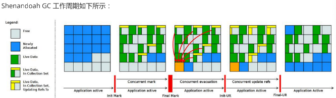

# jdk12

## Shenandoah GC: 低停顿时间的GC
Shenandoah 垃圾回收器是 Red Hat 在 2014 年宣布进行的一项垃圾收集器研究项目 Pauseless GC 的实现，旨在针 对 JVM 上的内存收回实现低停顿的需求。该设计将与应用程序线程并发，通过换 CPU 并发周期和空间以改善停顿时间，使得垃圾回收器执行线程能够在 Java 线程运行时进行堆压缩，并且标记和整理能够同时进行，因此避免了在大多数 JVM 垃圾收集器中所遇到的问题。  

据 Red Hat 研发 Shenandoah 团队对外宣称，Shenandoah 垃圾回收器的暂停时间与堆大小无关，这意味着无论将堆设置为 200 MB 还是 200 GB，都将拥有一致的系统暂停时间，不过实际使用性能将取决于实际工作堆的大小和工作负载。  

与其他 Pauseless GC 类似，Shenandoah GC 主要目标是 99.9% 的暂停小于 10ms，暂停与堆大小无关等

### STW(stop-the-world)
指的是GC 事件发生过程中，停止所有的应用程序线程的执行

垃圾回收器的任务是识别和回收垃圾对象进行内存清理。为了让垃圾回收器可以正常且高效地执行，大部分情况下会要求系统进入一个停顿的状态。停顿的目的是终止所有应用程序的执行，只有这样，系统中才不会有新的垃圾产生，同时停顿保证了系统状态在某一个瞬间的一致性，也有益于垃圾回收器更好地标记垃圾对象。因此，在垃圾回收时，都会产生应用程序的停顿。停顿产生时整个应用程序会被暂停，没有任何响应，有点像卡死的感觉，这个停顿称为STW

如果Stop-the- World 出现在新生代的Minor GC 中时， 由于新生代的内存空间通常都比较小， 所以暂停时间也在可接受的合理范围之内，不过一旦出现在老年代的Full GC 中时，程序的工作线程被暂停的时间将会更久。简单来说，内存空间越大，执行Full GC 的时间就会越久， 相对的工作线程被暂停的时间也就会更长

到目前为止，哪怕是G1 也不能完全避免Stop-the-world 情况发生，只能说垃圾回收器越来越优秀，回收效率越来越高，尽可能地缩短了暂停时间

### 垃圾回收器的分类
- 按线程数分，可以分为串行垃圾回收器和并行垃圾回收器
  - 串行回收指的是在同一时间段内只允许一件事情发生，简单来说，当多个CPU 可用时，也只能有一个CPU用于执行垃圾回收操作，井且在执行垃圾回收时，程序中的工作线程将会被暂停，当垃圾收集工作完成后
  - 才会恢复之前被暂停的工作线程，这就是串行回收。和串行回收相反，并行收集可以运用多个CPU 同时执行垃圾回收，因此提升了应用的吞吐量，不过并行回收仍然与串行回收一样，采用独占式，使用了“Stop-the-world”机制和复制算法。
- 按照工作模式分，可以分为并发式回收器和独占式垃圾回收器
  - 并发式垃圾回收器与应用程序线程交替工作，以尽可能减少应用程序的停顿时间。
  - 独占式垃圾回收器（ Stop the world)一旦运行，就停止应用程序中的其他所有线程，直到垃圾回收过程完全结束
- 按碎片处理方式可分为压缩式垃圾回收器和非压缩式垃圾回收器
  - 压缩式垃圾回收器会在回收完成后，对存活对象进行压缩整理，消除回收后的碎片。
  - 非压缩式的垃圾回收器不进行这步操作
- 按工作的内存区间，又可分为年轻代垃圾回收器和老年代垃圾回收器

### GC性能评估指标
- 吞吐量：程序的运行时间（程序的运行时间＋内存回收的时间）。
- 垃圾收集开销：吞吐量的补数，垃圾收集器所占时间与总时间的比例。
- 暂停时间：执行垃圾收集时，程序的工作线程被暂停的时间。
- 收集频率：相对于应用程序的执行，收集操作发生的频率。
- 堆空间： Java 堆区所占的内存大小。
- 快速： 一个对象从诞生到被回收所经历的时间

### 工作原理
从原理的角度，我们可以参考该项目官方的示意图，其内存结构与 G1 非常相似，都是将内存划分为类似棋盘的region。整体流程与 G1 也是比较相似的，最大的区别在于实现了并发的疏散(Evacuation) 环节，引入的 BrooksForwarding Pointer 技术使得 GC 在移动对象时，对象引用仍然可以访问


```
上图对应工作周期如下:  
1. Init Mark 启动并发标记阶段   
2. 并发标记遍历堆阶段   
3. 并发标记完成阶段   
4. 并发整理回收无活动区域阶段   
5. 并发 Evacuation 整理内存区域阶段   
6. Init Update Refs 更新引用初始化阶段   
7. 并发更新引用阶段   
8. Final Update Refs 完成引用更新阶段   
9. 并发回收无引用区域阶段  
```

### 配置或调试 Shenandoah 的 JVM 参数
```bash
-XX:+AlwaysPreTouch：使用所有可用的内存分页，减少系统运行停顿，为避免运行时性能损失。 

-Xmx == -Xmsv：设置初始堆大小与最大值一致，可以减轻伸缩堆大小带来的压力，与 AlwaysPreTouch 参数配 合使用，在启动时提交所有内存，避免在最终使用中出现系统停顿。 

-XX:+ UseTransparentHugePages：能够大大提高大堆的性能，同时建议在 Linux 上使用时将 /sys/kernel/mm/transparent_hugepage/enabled 和 /sys/kernel/mm/transparent_hugepage/defragv 设置为：madvise，同时与 AlwaysPreTouch 一起使 用时，init 和 shutdownv 速度会更快，因为它将使用更大的页面进行预处理。 

-XX:+UseNUMA：虽然 Shenandoah 尚未明确支持 NUMA（Non-Uniform Memory Access），但最好启用此功 能以在多插槽主机上启用 NUMA 交错。与 AlwaysPreTouch 相结合，它提供了比默认配置更好的性能。 

-XX:+DisableExplicitGC：忽略代码中的 System.gc() 调用。当用户在代码中调用 System.gc() 时会强制 Shenandoah 执行 STW Full GC ，应禁用它以防止执行此操作，另外还可以使用 
- XX:+ExplicitGCInvokesConcurrent，在 调用 System.gc() 时执行 CMS GC 而不是 Full GC，建议在有 System.gc() 调用的情况下使用。 

不过目前 Shenandoah 垃圾回收器还被标记为实验项目，如果要使用Shenandoah GC需要编译时--with-jvm- features选项带有shenandoahgc，然后启动时使用参数 
-XX:+UnlockExperimentalVMOptions -XX:+UseShenandoahGC
```

## JVM常量 api
Java 12 中引入 JVM 常量 API，用来更容易地对关键类文件 (key class-file) 和运行时构件（artefact）的名义描述(nominal description) 进行建模，特别是对那些从常量池加载的常量，这是一项非常技术性的变化，能够以更简单、标准的方式处理可加载常量

引入了ConstantDesc接口( ClassDesc、MethodTypeDesc、MethodHandleDesc这几个接口直接继承了ConstantDesc 接口 )以及Constable接口；ConstantDesc接口定义了resolveConstantDesc方法，Constable接口定义了describeConstable方法；String、Integer、Long、Float、Double均实现了这两个接口，而EnumDesc实现了ConstantDesc接口

## 微基准测试套件

### JMH
JMH，即Java Microbenchmark Harness，是专门用于代码微基准测试的工具套件。何谓Micro Benchmark呢？简单的来说就是基于方法层面的基准测试，精度可以达到微秒级。当你定位到热点方法，希望进一步优化方法性能的时候，就可以使用JMH对优化的结果进行量化的分析

### JMH应用场景 
- 想准确的知道某个方法需要执行多长时间，以及执行时间和输入之间的相关性；
- 对比接口不同实现在给定条件下的吞吐量；
- 查看多少百分比的请求在多长时间内完成；

### 新特性说明 
Java 12 中添加一套新的基本的微基准测试套件（microbenchmarks suite），此功能为JDK源代码添加了一套微基准测试（大约100个），简化了现有微基准测试的运行和新基准测试的创建过程。使开发人员可以轻松运行现有的微基准测试并创建新的基准测试，其目标在于提供一个稳定且优化过的基准。 它基于Java MicrobenchmarkHarness（JMH），可以轻松测试JDK性能，支持JMH更新

## 只保留一个AArch64实现
当前 Java 11 及之前版本JDK中存在两个64位ARM端口。这些文件的主要来源位于 src/hotspot/cpu/arm 和 open/src/hotspot/cpu/aarch64 目录中。尽管两个端口都产生了 aarch64 实现，我们将前者（由Oracle贡献）称为 arm64 ，将后者称为 aarch64

Java 12 中将删除由 Oracle 提供的 arm64端口相关的所有源码，即删除目录 open/src/hotspot/cpu/arm 中关于64-bit 的这套实现，只保留其中有关 32-bit ARM端口的实现，余下目录的 open/src/hotspot/cpu/aarch64 代码部分就成了 AArch64 的默认实现

## 默认生成类数据共享(CDS)归档文件
我们知道在同一个物理机／虚拟机上启动多个JVM时，如果每个虚拟机都单独装载自己需要的所有类，启动成本和内存占用是比较高的。所以Java团队引入了类数据共享机制 (Class Data Sharing ，简称 CDS) 的概念，通过把一些核心类在每个JVM间共享，每个JVM只需要装载自己的应用类即可。好处是：启动时间减少了，另外核心类是共享的，所以JVM的内存占用也减少了

Java 12 针对 64 位平台下的 JDK 构建过程进行了增强改进，使其默认生成类数据共享（CDS）归档，以进一步达到改进应用程序的启动时间的目的，同时也避免了需要手动运行：java -Xshare:dump 的需要，修改后的 JDK 将在${JAVA_HOME}/lib/server 目录中生成一份名为classes.jsa的默认archive文件(大概有18M)方便大家使用

## 可中断的 G1 Mixed GC
当 G1 垃圾回收器的回收超过暂停时间的目标，则能中止垃圾回收过程

G1 采用一个高级分析引擎来选择在收集期间要处理的工作量，此选择过程的结果是一组称为 GC 回收集（collectionset( CSet )）的区域。一旦收集器确定了 GC 回收集 并且 GC 回收、整理工作已经开始，这个过程是withoutstopping的，即 G1 收集器必须完成收集集合的所有区域中的所有活动对象之后才能停止；但是如果收集器选择过大的 GC 回收集，此时的STW时间会过长超出目标pause time

这种情况在mixed collections时候比较明显。这个特性启动了一个机制，当选择了一个比较大的collection set，Java12 中将把 GC 回收集（混合收集集合）拆分为mandatory（必需或强制）及optional两部分( 当完成mandatory的部 分，如果还有剩余时间则会去处理optional部分 )来将mixed collections从without stopping变为abortable，以更好满足指定pause time的目标

## 增强G1，自动返回未用堆内存给操作系统

## 增加项：支持压缩数字格式化
```java
//数字格式压缩
@org.junit.Test
public void t1() {
    var cnf = NumberFormat.getCompactNumberInstance(Locale.CHINA, NumberFormat.Style.SHORT);
    System.out.println(cnf.format(1_0000));
    System.out.println(cnf.format(1_9200));
    System.out.println(cnf.format(1_000_000));
    System.out.println(cnf.format(1L << 30));
    System.out.println(cnf.format(1L << 40));
    System.out.println(cnf.format(1L << 50));

    //输出
    1万
    2万
    100万
    11亿
    1万亿
    1126万亿
}
```

## 增加项:String 新方法
```java
//String: transform
@org.junit.Test
public void t2() {
    var result = "foo".transform(input -> input + " bar");
    System.out.println(result); // foo bar

    var result2 = "foo".transform(input -> input + " bar").transform(String::toUpperCase);
    System.out.println(result2); // FOO BAR

    System.out.println("======test java 12 transform======");
    List<String> list1 = List.of("Java", " Python", " C++ ");
    List<String> list2 = new ArrayList<>();
    list1.forEach(element -> list2.add(element.transform(String::strip).transform(String::toUpperCase).transform((e) -> "Hi," + e)));
    list2.forEach(System.out::println);

    System.out.println("======test before java 12 ======");
    List<String> list11 = List.of("Java ", " Python", " C++ ");
    Stream<String> stringStream = list11.stream().map(element -> element.strip()).map(String::toUpperCase).map(element -> "Hello," + element);
    List<String> list22 = stringStream.collect(Collectors.toList());
    list22.forEach(System.out::println);
}

//String: indent 该方法允许我们调整String实例的缩进
@org.junit.Test
public void t3() {
    System.out.println("======test java 12 indent======");
    String result = "Java\n Python\nC++".indent(3);
    System.out.println(result);

    /* 输出如下
    ======test java 12 indent======
        Java
        Python
        C++
    
```

## Files
```java
//Files: mismatch 返回首次不匹配的position,完全不匹配返回-1
@org.junit.Test
public void t4() throws IOException {
    FileWriter fileWriter = new FileWriter("src/jdk_version/java12/a.txt");
    fileWriter.write("a");
    fileWriter.write("b");
    fileWriter.write("c");
    fileWriter.close();
    FileWriter fileWriterB = new FileWriter("src/jdk_version/java12/b.txt");
    fileWriterB.write("a");
    fileWriterB.write("1");
    fileWriterB.write("c");
    fileWriterB.close();
    System.out.println(Files.mismatch(Path.of("src/jdk_version/java12/a.txt"), Path.of("src/jdk_version/java12/b.txt")));
}
```