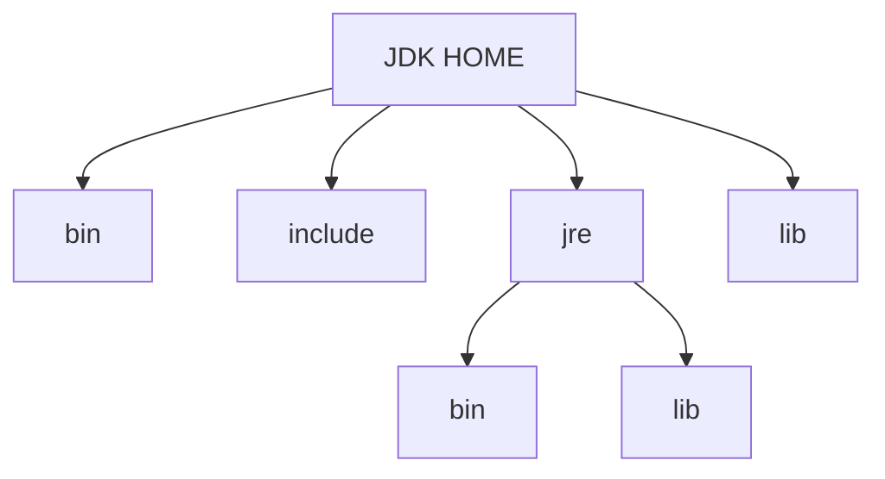
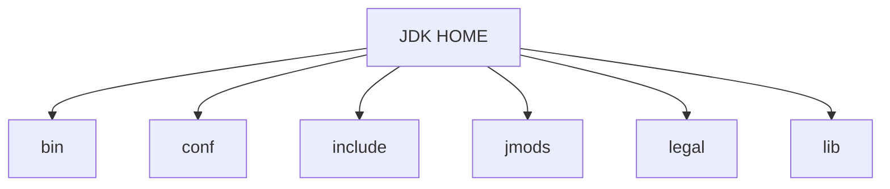

# jdk9

## jdk和jre的改变

### 区别
jdk: java开发工具包  
jre: java运行环境  

JDK = JRE + 开发工具集（例如 Javac 编译工具等）  
JRE = JVM + Java SE 标准类库

### jdk8目录结构



|目录|说明|
|:---|:---|
|bin 目录| 包含命令行开发和调试工具，如 javac，jar 和 javadoc。 |
|include 目录| 包含在编译本地代码时使用的 C/C++头文件|
|lib 目录 包含| JDK 工具的几个 JAR 和其他类型的文件。 它有一个 tools.jar 文件，其中包含 javac 编译器的 Java 类|
|jre/bin 目录| 包含基本命令，如 java 命令。 在 Windows 平台上，它包含系统的运行时动态链接库（DLL）。|
|jre/lib 目录| 包含用户可编辑的配置文件，如.properties 和.policy文件。包含几个 JAR。 rt.jar 文件包含运行时的 Java类和资源文件。|

### jdk9目录结构



|目录|说明|
|:---|:---|
|bin 目录| 包含所有命令。 在 Windows 平台上，它继续包含系统的运行时动态链接库。|
|conf 目录| 包含用户可编辑的配置文件，例如以前位于 jre\lib 目录中的.properties 和.policy 文件|
|include 目录| 包含要在以前编译本地代码时使用的 C/C++头文件。它只存在于 JDK 中|
|jmods 目录 |包含 JMOD 格式的平台模块。 创建自定义运行时映像时需要它。 它只存在于 JDK 中|
|legal 目录 |包含法律声明|
|lib 目录 |包含非 Windows 平台上的动态链接本地库。 其子目录和文件不应由开发人员直接编辑或使用|

## 模块化:igsaw -> Modularity
模块将由通常的类和新的模块声明文件（module-info.java）组成。该文件是位于 java 代码结构的顶层，该模块描述符明确地定义了我们的模块需要什么依赖关系，以及哪些模块被外部使用
```java
//module-info.java 必须在src目录下指定引入哪些模块及输入哪些模块
module java.learning {
     exports jdk_version.java9ModulDemo.bean;
     requires junit;
     requires commons.io;
}
```

##  Java 的 REPL 工具： jShell 命令
* Java 9 中终于拥有了 REPL 工具：jShell。利用 jShell 在没有创建类的情况下直接声明变量，计算表达式，执行语句。即开发时可以在命令行里直接运行 java 的代码，而无需创建 Java 文件，无需跟人解释`public static void main(String[] args)`这句废话。
* jShell 也可以从文件中加载语句或者将语句保存到文件中。
* jShell 也可以是 tab 键进行自动补全和自动添加分号

```shell
# jshell调出

# /help intro 获取帮助

# tab键自动补全

# /exit退出
```

## 多版本兼容jar包
```bash
# 如9版本中只会用到META-INFO下9版本的A.class和B.class, 之前的版本只会用到上面的
jar root
- A.class
- B.class
- C.class
- D.class
- META-INF
    - versions
        - 9 
            - A.class
            - B.class
```

测试代码: multijar.jar

## 语法改进:接口的私有方法
接口在java8中增加了default和static的方法,java9开始可以声明private方法  
实现类无需实现private方法,且无法调用

## 语法改进:钻石操作符(Diamond Operator)使用升级
我们将能够与匿名实现类共同使用钻石操作符（diamond operator）  
```java
public class DiamondOperatorTest {

    @Test
    public void testDiamondOperator() {
        diamondOperator();
    }

    public void diamondOperator() {
        //创建一个继承于HashSet的匿名子类的对象
//        Set<String> set = new HashSet<String>(){};//java8需写成这样, 否则编译不通过
        Set<String> set = new HashSet<>() {
        };//编译通过
        set.add("MM");
        set.add("JJ");
        set.add("GG");
        set.add("DD");

        for (String s : set) {
            System.out.println(s);
        }

    }
}
```

## 语法改进: try语句
```java
public class TryTest {
    //举例1：
    @Test
    public void testTry1() {
        InputStreamReader reader = null;
        try {
            reader = new InputStreamReader(System.in);
            //读取数据的过程：略
            reader.read();

        } catch (IOException e) {
            e.printStackTrace();
        } finally {
            //资源的关闭操作
            if (reader != null) {
                try {
                    reader.close();
                } catch (IOException e) {
                    e.printStackTrace();
                }
            }
        }

    }

    //举例2：在举例1基础上，升级的写法。不用显式的处理资源的关闭
    //java 8 中：要求资源对象的实例化，必须放在try的一对()内完成。
    //java 9 中：可以在try()中调用已经实例化的资源对象
    @Test
    public void testTry2() {
        try (InputStreamReader reader = new InputStreamReader(System.in)) {

            //读取数据的过程：略
            reader.read();
        } catch (IOException e) {
            e.printStackTrace();
        }
    }

    //如下的操作不可以在jdk 8 及之前的版本中使用
    @Test
    public void testTry3() {
        InputStreamReader reader = new InputStreamReader(System.in);
        OutputStreamWriter writer = new OutputStreamWriter(System.out);
        try (reader; writer) {
            //此时的reader是final的，不可再被赋值
//            reader = null;

            //读取数据的过程：略
            reader.read();
        } catch (IOException e) {
            e.printStackTrace();
        }
    }
}
```

## 语法改进：UnderScore(下划线)使用的限制

在 java 8 中，标识符可以独立使用“_”来命名  
但是，在 java 9 中规定“_”不再可以单独命名标识符了

## String存储结构变更

* String：jdk 8 及之前：底层使用char[]存储；jdk 9 : 底层使用byte[] (encoding flag)
* StringBuffer:jdk 8 及之前：底层使用char[]存储；jdk 9 : 底层使用byte[]
* StringBuilder:jdk 8 及之前：底层使用char[]存储；jdk 9 : 底层使用byte[]
* String：不可变的字符序列；
* StringBuffer:可变的字符序列；线程安全的，效率低；
* StringBuilder:可变的字符序列；线程不安全的，效率高（jdk 5.0)

## 集合工厂方法
* jdk8及以前
  > `Collections.unmodifiableList(list)`  
  > `Collections.unmodifiableList(Arrays.asList(1, 2, 3))`  
  > `Collections.unmodifiableSet(new HashSet<>(Arrays.asList(1, 2, 3)))`  
* jdk9
  > `List.of(1, 2, 3)`
  > `Set.of(2, 3, 4)`
  > `Map.of("Tom", 23, "Jerry", 22, "Lilei", 12, "HanMeimei", 18)`
  > `Map.ofEntries(Map.entry("Tom", 23), Map.entry("Jerry", 21))`

## 增强的Stream API
```java
public class StreamTest {

    //takeWhile: 返回从开头开始的尽量多的元素,一旦满足,后面的全不要
    @Test
    public void t1() {
        List<Integer> list = Arrays.asList(1, 2, 3, 4, 6, 4, 7, 9, 8);
        Stream<Integer> stream = list.stream();
        stream.takeWhile(x -> x < 5).forEach(System.out::println);
    }

    //dropWhile 与takeWhile相反,互补,一旦不满足,后面的全都要
    @Test
    public void t2() {
        List<Integer> list = Arrays.asList(1, 2, 3, 4, 6, 4, 7, 9, 8);
        Stream<Integer> stream = list.stream();
        stream.dropWhile(x -> x < 5).forEach(System.out::println);
    }

    //ofNullable: ofNullable 方法允许我们创建一个单元素 Stream，可以包含一个非空元素，也可以创建一个空 Stream。
    @Test
    public void t3() {
        Stream<Integer> stream1 = Stream.of(1, 2, null);
        stream1.forEach(System.out::println);

//        Stream<Object> stream2 = Stream.of(null);//报 NullPointerException

        //ofNullable()：允许值为 null
        Stream<Object> stream3 = Stream.ofNullable(null);
        System.out.println(stream3.count());//0

        Stream<String> stream4 = Stream.ofNullable("hello world");
        System.out.println(stream4.count());//1

    }

    //重载的 iterate
    @Test
    public void t4() {
        Stream.iterate(0, x -> x + 1).limit(10).forEach(System.out::println);

        Stream.iterate(0, x -> x < 10, x -> x + 1).forEach(System.out::println);
    }

    //optional 的stream
    @Test
    public void t5() {
        List<String> list = new ArrayList<>();
        list.add("Jerry");
        list.add("Tim");
        Optional<List<String>> optional = Optional.ofNullable(list);
        Stream<List<String>> stream = optional.stream();
        stream.flatMap(x -> x.stream()).forEach(System.out::println);
    }

}
```

## 多分辨率图象api
在 Mac 上，JDK 已经支持视网膜显示，但在 Linux 和 Windows 上，它并没有。在那里，Java 程序在当前的高分辨率屏幕上可能看起来很小，不能使用它们。这是因为像素用于这些系统的大小计算（无论像
素实际有多大）。毕竟，高分辨率显示器的有效部分是像素非常小。  
JEP 263 以这样的方式扩展了 JDK，即 Windows 和 Linux 也考虑到像素的大小。为此，使用比现在更多的现代 API：Direct2D for Windows和 GTK +，而不是 Xlib for Linux。图形，窗口和文本由此自动缩放。  
JEP 251 还提供处理多分辨率图像的能力，即包含不同分辨率的相同图像的文件。根据相应屏幕的 DPI 度量，然后以适当的分辨率使用图像

## 全新的 HTTP 客户端 API
HTTP/1.1和HTTP/2的主要区别是如何在客户端和服务器之间构建和传输数据。HTTP/1.1 依赖于请求/响应周期。 HTTP/2 允许服务器“push”数据：它可以发送比客户端请求更多的数据。 这使得它可以优先处理并发送对于首先加载网页至关重要的数据.  
Java 9 中有新的方式来处理 HTTP 调用。它提供了一个新的 HTTP客户端（ HttpClient ）， 它将替代仅适用于 blocking 模式的HttpURLConnection （HttpURLConnection是在HTTP 1.0的时代创建的，并使用了协议无关的方法），并提供对 WebSocket 和 HTTP/2 的支持。此外，HTTP 客户端还提供 API 来处理 HTTP/2 的特性，比如流和服务器推送等功能.
```java
/**
 * 需在module-info中导入 requires jdk.incubator.httpclient;
 */
public class HttpClientTest {

    public static void main(String[] args) {
        //jdk 9 中 使用 HttpClient替换原有的HttpURLConnection
        try {
            HttpClient client = HttpClient.newHttpClient();

            HttpRequest req = HttpRequest.newBuilder(URI.create("http://www.atguigu.com")).GET().build();

            HttpResponse<String> response = null;
            response = client.send(req, HttpResponse.BodyHandler.asString());
            System.out.println(response.statusCode());
            System.out.println(response.version().name());
            System.out.println(response.body());

        } catch (IOException e) {
            e.printStackTrace();
        } catch (InterruptedException e) {
            e.printStackTrace();
        }
    }
}
```

## Deprecated相关api
Java 9 废弃或者移除了几个不常用的功能。其中最主要的是Applet API，现在是标记为废弃的。随着对安全要求的提高，主流浏览器已经取消对 Java 浏览器插件的支持。HTML5 的出现也进一步加
速了它的消亡。开发者现在可以使用像 Java Web Start 这样的技术来代替 Applet，它可以实现从浏览器启动应用程序或者安装应用程序。同时，appletviewer 工具也被标记为废弃

## 智能java编译工具
智能 java 编译工具( sjavac )的第一个阶段始于 JEP139 这个项目，用于在多核处理器情况下提升 JDK 的编译速度。如今，这个项目已经进入第二阶段，即 JEP199，其目的是改进 Java 编译工具，并取代目
前 JDK 编译工具 javac，继而成为 Java 环境默认的通用的智能编译工具。  
JDK 9 还更新了 javac 编译器以便能够将 java 9 代码编译运行在低版本 Java 中

## 统一的jvm日志系统
日志是解决问题的唯一有效途径：曾经很难知道导致 JVM 性能问题和导致 JVM 崩溃的根本原因。不同的 JVM 日志的碎片化和日志选项（例如：JVM 组件对于日志使用的是不同的机制和规则），这使得 JVM 难以进行调试  
解决该问题最佳方法：对所有的 JVM 组件引入一个单一的系统，这些 JVM 组件支持细粒度的和易配置的 JVM 日志

## javadoc的html5支持

## javascript引擎升级:Nashorn
Nashorn 项目在 JDK 9 中得到改进，它为 Java 提供轻量级的Javascript 运行时。Nashorn 项目跟随 Netscape 的 Rhino 项目，目的是为了在 Java 中实现一个高性能但轻量级的 Javascript 运行时。
Nashorn 项目使得 Java 应用能够嵌入 Javascript。它在 JDK 8 中为Java 提供一个 Javascript 引擎。  
JDK 9 包含一个用来解析 Nashorn 的 ECMAScript 语法树的API。这个 API 使得 IDE 和服务端框架不需要依赖 Nashorn 项目的内部实现类，就能够分析 ECMAScript 代码。

## java的动态编译器
JIT（Just-in-time）编译器可以在运行时将热点编译成本地代码，速度很快。但是 Java 项目现在变得很大很复杂，因此 JIT 编译器需要花费较长时间才能热身完，而且有些 Java 方法还没法编译，性能方面也会下降。AoT 编译就是为了解决这些问题而生的。  
在 JDK 9 中， AOT（JEP 295: Ahead-of-Time Compilation）作为实验特性被引入进来，开发者可以利用新的 jaotc 工具将重点代码转换成类似类库一样的文件。虽然仍处于试验阶段，但这个功能使得 Java 应用在被虚拟机启动之前能够先将 Java 类编译为原生代码。此功能旨在改进小型和大型应用程序的启动时间，同时对峰值性能的影响很小
