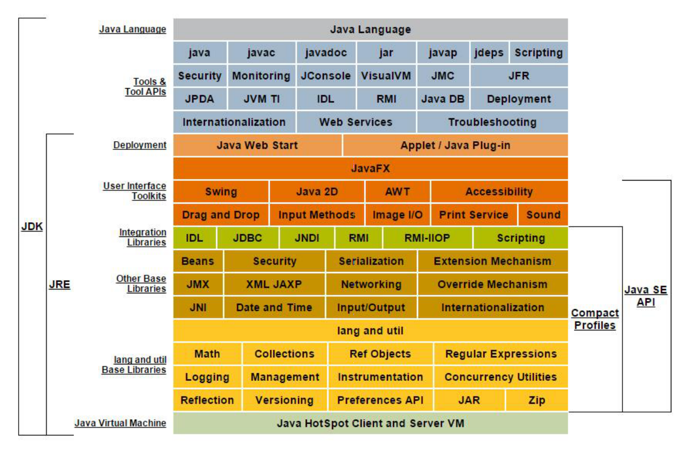
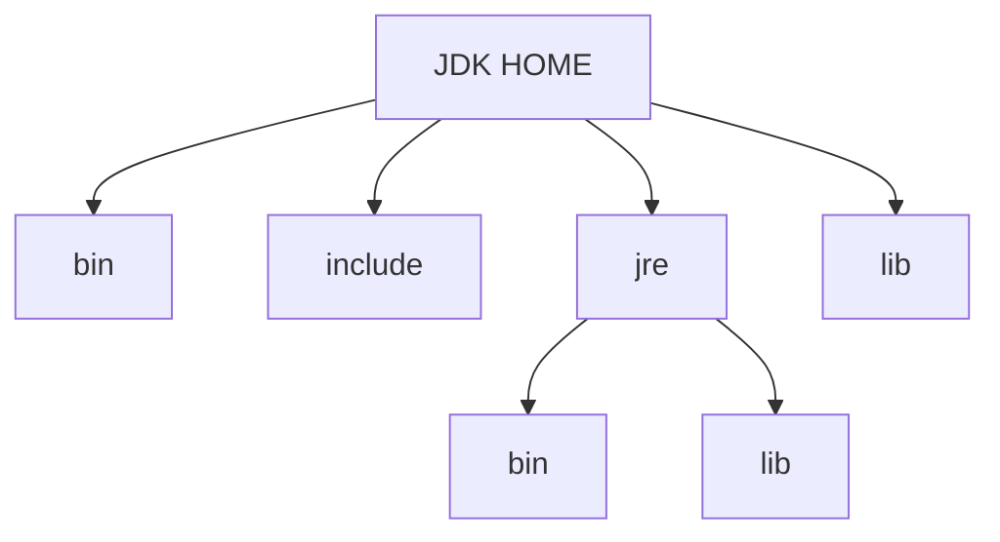
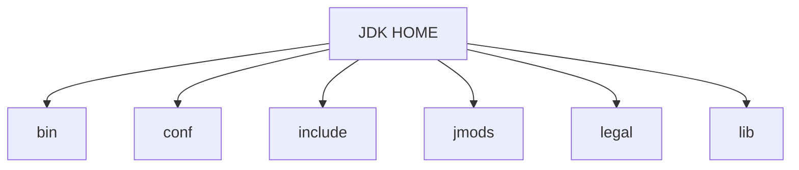

# jdk9

## jdk和jre的改变

### 区别
jdk: java开发工具包  
jre: java运行环境  

JDK = JRE + 开发工具集（例如 Javac 编译工具等）  
JRE = JVM + Java SE 标准类库

### jdk8目录结构



|目录|说明|
|:---|:---|
|bin 目录| 包含命令行开发和调试工具，如 javac，jar 和 javadoc。 |
|include 目录| 包含在编译本地代码时使用的 C/C++头文件|
|lib 目录 包含| JDK 工具的几个 JAR 和其他类型的文件。 它有一个 tools.jar 文件，其中包含 javac 编译器的 Java 类|
|jre/bin 目录| 包含基本命令，如 java 命令。 在 Windows 平台上，它包含系统的运行时动态链接库（DLL）。|
|jre/lib 目录| 包含用户可编辑的配置文件，如.properties 和.policy文件。包含几个 JAR。 rt.jar 文件包含运行时的 Java类和资源文件。|

### jdk9目录结构



|目录|说明|
|:---|:---|
|bin 目录| 包含所有命令。 在 Windows 平台上，它继续包含系统的运行时动态链接库。|
|conf 目录| 包含用户可编辑的配置文件，例如以前位于 jre\lib 目录中的.properties 和.policy 文件|
|include 目录| 包含要在以前编译本地代码时使用的 C/C++头文件。它只存在于 JDK 中|
|jmods 目录 |包含 JMOD 格式的平台模块。 创建自定义运行时映像时需要它。 它只存在于 JDK 中|
|legal 目录 |包含法律声明|
|lib 目录 |包含非 Windows 平台上的动态链接本地库。 其子目录和文件不应由开发人员直接编辑或使用|

## 模块化:igsaw -> Modularity
模块将由通常的类和新的模块声明文件（module-info.java）组成。该文件是位于 java 代码结构的顶层，该模块描述符明确地定义了我们的模块需要什么依赖关系，以及哪些模块被外部使用
```java
//module-info.java 必须在src目录下指定引入哪些模块及输入哪些模块
module java.learning {
     exports jdk_version.java9ModulDemo.bean;
     requires junit;
     requires commons.io;
}
```

##  Java 的 REPL 工具： jShell 命令
* Java 9 中终于拥有了 REPL 工具：jShell。利用 jShell 在没有创建类的情况下直接声明变量，计算表达式，执行语句。即开发时可以在命令行里直接运行 java 的代码，而无需创建 Java 文件，无需跟人解释`public static void main(String[] args)`这句废话。
* jShell 也可以从文件中加载语句或者将语句保存到文件中。
* jShell 也可以是 tab 键进行自动补全和自动添加分号

```shell
# jshell调出

# /help intro 获取帮助

# tab键自动补全

# /exit退出
```

## 多版本兼容jar包
```bash
# 如9版本中只会用到META-INFO下9版本的A.class和B.class, 之前的版本只会用到上面的
jar root
- A.class
- B.class
- C.class
- D.class
- META-INF
    - versions
        - 9 
            - A.class
            - B.class
```

测试代码: multijar.jar

## 语法改进:接口的私有方法
接口在java8中增加了default和static的方法,java9开始可以声明private方法  
实现类无需实现private方法,且无法调用

## 语法改进:钻石操作符(Diamond Operator)使用升级
我们将能够与匿名实现类共同使用钻石操作符（diamond operator）  
```java
public class DiamondOperatorTest {

    @Test
    public void testDiamondOperator() {
        diamondOperator();
    }

    public void diamondOperator() {
        //创建一个继承于HashSet的匿名子类的对象
//        Set<String> set = new HashSet<String>(){};//java8需写成这样, 否则编译不通过
        Set<String> set = new HashSet<>() {
        };//编译通过
        set.add("MM");
        set.add("JJ");
        set.add("GG");
        set.add("DD");

        for (String s : set) {
            System.out.println(s);
        }

    }
}
```

## 语法改进: try语句
```java
public class TryTest {
    //举例1：
    @Test
    public void testTry1() {
        InputStreamReader reader = null;
        try {
            reader = new InputStreamReader(System.in);
            //读取数据的过程：略
            reader.read();

        } catch (IOException e) {
            e.printStackTrace();
        } finally {
            //资源的关闭操作
            if (reader != null) {
                try {
                    reader.close();
                } catch (IOException e) {
                    e.printStackTrace();
                }
            }
        }

    }

    //举例2：在举例1基础上，升级的写法。不用显式的处理资源的关闭
    //java 8 中：要求资源对象的实例化，必须放在try的一对()内完成。
    //java 9 中：可以在try()中调用已经实例化的资源对象
    @Test
    public void testTry2() {
        try (InputStreamReader reader = new InputStreamReader(System.in)) {

            //读取数据的过程：略
            reader.read();
        } catch (IOException e) {
            e.printStackTrace();
        }
    }

    //如下的操作不可以在jdk 8 及之前的版本中使用
    @Test
    public void testTry3() {
        InputStreamReader reader = new InputStreamReader(System.in);
        OutputStreamWriter writer = new OutputStreamWriter(System.out);
        try (reader; writer) {
            //此时的reader是final的，不可再被赋值
//            reader = null;

            //读取数据的过程：略
            reader.read();
        } catch (IOException e) {
            e.printStackTrace();
        }
    }
}
```

## 语法改进：UnderScore(下划线)使用的限制

在 java 8 中，标识符可以独立使用“_”来命名  
但是，在 java 9 中规定“_”不再可以单独命名标识符了

## String存储结构变更

* String：jdk 8 及之前：底层使用char[]存储；jdk 9 : 底层使用byte[] (encoding flag)
* StringBuffer:jdk 8 及之前：底层使用char[]存储；jdk 9 : 底层使用byte[]
* StringBuilder:jdk 8 及之前：底层使用char[]存储；jdk 9 : 底层使用byte[]
* String：不可变的字符序列；
* StringBuffer:可变的字符序列；线程安全的，效率低；
* StringBuilder:可变的字符序列；线程不安全的，效率高（jdk 5.0)

## 集合工厂方法
