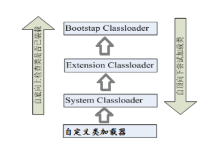

# 反射 Reflection

## 概述
* Reflection（反射）是被视为动态语言的关键，反射机制允许程序在执行期借助于Reflection API取得任何类的内部信息，并能直接操作任意对象的内部属性及方法。
* 加载完类之后，在堆内存的方法区中就产生了一个Class类型的对象（一个类只有一个Class对象），这个对象就包含了完整的类的结构信息。我们可以通过这个对象看到类的结构。这个对象就像一面镜子，透过这个镜子看到类的结构，所以，我们形象的称之为：反射

### 动态语言与静态语言
* 动态语言  
是一类在运行时可以改变其结构的语言：例如新的函数、对象、甚至代码可以被引进，已有的函数可以被删除或是其他结构上的变化。通俗点说就是在运行时代码可以根据某些条件改变自身结构。  
主要动态语言：Object-C、C#、JavaScript、PHP、Python、Erlang。 
* 静态语言  
与动态语言相对应的，运行时结构不可变的语言就是静态语言。如Java、C、C++。
> Java不是动态语言，但Java可以称之为“准动态语言”。即Java有一定的动态性，我们可以利用反射机制、字节码操作获得类似动态语言的特性。Java的动态性让编程的时候更加灵活

### 反射机制提供的功能
* 在运行时判断任意一个对象所属的类
* 在运行时构造任意一个类的对象
* 在运行时判断任意一个类所具有的成员变量和方法
* 在运行时获取泛型信息
* 在运行时调用任意一个对象的成员变量和方法
* 在运行时处理注解
* 生成动态代理

### 主要api
* java.lang.Class:代表一个类 * java.lang.reflect.Method:代表类的方法
* java.lang.reflect.Field:代表类的成员变量
* java.lang.reflect.Constructor:代表类的构造器 
* …

## Class类
程序经过javac.exe命令以后，会生成一个或多个字节码文件(.class结尾)。接着我们使用java.exe命令对某个字节码文件进行解释运行。相当于将某个字节码文件加载到内存中。此过程就称为类的加载。加载到内存中的类，我们就称为运行时类，此运行时类，就作为Class的一个实例
* Class本身也是一个类
* Class 对象只能由系统建立对象
* 一个加载的类在 JVM 中只会有一个Class实例
* 一个Class对象对应的是一个加载到JVM中的一个.class文件
* 每个类的实例都会记得自己是由哪个 Class 实例所生成
* 通过Class可以完整地得到一个类中的所有被加载的结构
* Class类是Reflection的根源，针对任何你想动态加载、运行的类，唯有先获得相应的Class对象

### 常用方法
|方法名| 功能说明|
|:---|:----|
|static Class forName(String name)| 返回指定类名 name 的 Class 对象|
|Object newInstance()| 调用缺省构造函数，返回该Class对象的一个实例|
|getName()| 返回此Class对象所表示的实体（类、接口、数组类、基本类型或void）名称|
|Class getSuperClass()| 返回当前Class对象的父类的Class对象|
|Class [] getInterfaces()| 获取当前Class对象的接口|
|ClassLoader getClassLoader()| 返回该类的类加载器|
|Class getSuperclass()| 返回表示此Class所表示的实体的超类的Class|
|Constructor[] getConstructors()| 返回一个包含某些Constructor对象的数组|
|Field[] getDeclaredFields()| 返回Field对象的一个数组|
|Method getMethod(String name,Class … paramTypes)|返回一个Method对象，此对象的形参类型为paramType|

### 获取Class实例方法
* 前提：若已知具体的类，通过类的class属性获取，该方法最为安全可靠，程序性能最高  
  实例：`Class clazz = String.class`; 
* 前提：已知某个类的实例，调用该实例的`getClass()`方法获取Class对象  
  实例：`Class clazz = “www.atguigu.com”.getClass()`;
* 前提：已知一个类的全类名，且该类在类路径下，可通过Class类的静态方法forName()获取，可能抛出ClassNotFoundException  
  实例：`Class clazz = Class.forName(“java.lang.String”)`;
* 其他方式
    > `ClassLoader cl = this.getClass().getClassLoader();`
    > `Class clazz4 = cl.loadClass(“类的全类名”);`
    ```java
    @Test
    public void test3() throws ClassNotFoundException {
        //方式一：调用运行时类的属性：.class
        Class clazz1 = Person.class;
        System.out.println(clazz1);
        //方式二：通过运行时类的对象,调用getClass()
        Person p1 = new Person();
        Class clazz2 = p1.getClass();
        System.out.println(clazz2);

        //方式三：调用Class的静态方法：forName(String classPath)
        Class clazz3 = Class.forName("reflection.ref_01.Person");
        //clazz3 = Class.forName("java.lang.String");
        System.out.println(clazz3);

        System.out.println(clazz1 == clazz2);
        System.out.println(clazz1 == clazz3);

        //方式四：使用类的加载器：ClassLoader  (了解)
        ClassLoader classLoader = ReflectionTest.class.getClassLoader();
        Class clazz4 = classLoader.loadClass("reflection.ref_01.Person");
        System.out.println(clazz4);

        System.out.println(clazz1 == clazz4);

    }
    ```

### 有Class对象的类型
```java
@Test
public void test3() throws ClassNotFoundException {
    //方式一：调用运行时类的属性：.class
    Class clazz1 = Person.class;
    System.out.println(clazz1);
    //方式二：通过运行时类的对象,调用getClass()
    Person p1 = new Person();
    Class clazz2 = p1.getClass();
    System.out.println(clazz2);

    //方式三：调用Class的静态方法：forName(String classPath)
    Class clazz3 = Class.forName("reflection.ref_01.Person");
//        clazz3 = Class.forName("java.lang.String");
    System.out.println(clazz3);

    System.out.println(clazz1 == clazz2);
    System.out.println(clazz1 == clazz3);

    //方式四：使用类的加载器：ClassLoader  (了解)
    ClassLoader classLoader = ReflectionTest.class.getClassLoader();
    Class clazz4 = classLoader.loadClass("reflection.ref_01.Person");
    System.out.println(clazz4);

    System.out.println(clazz1 == clazz4);

}
```

## ClassLoader

### 类的加载过程
当程序主动使用某个类时，如果该类还未被加载到内存中，则系统会通过如下三个步骤来对该类进行初始化  
类的加载(Load) --------> 类的链接(Link) --------> 类的实始化(Initialize)  

* 加载：将class文件字节码内容加载到内存中，并将这些静态数据转换成方法区的运行时数据结构，然后生成一个代表这个类的java.lang.Class对象，作为方法区中类数据的访问入口（即引用地址）。所有需要访问和使用类数据只能通过这个Class对象。这个加载的过程需要类加载器参与。 
* 链接：将Java类的二进制代码合并到JVM的运行状态之中的过程。
    > 1.验证：确保加载的类信息符合JVM规范，例如：以cafe开头，没有安全方面的问题  
    > 2.准备：正式为类变量（static）分配内存并设置类变量默认初始值的阶段，这些内存都将在方法区中进行分配。   
    > 3.解析：虚拟机常量池内的符号引用（常量名）替换为直接引用（地址）的过程。   
* 初始化：
    > 1.执行类构造器<clinit>()方法的过程。类构造器<clinit>()方法是由编译期自动收集类中所有类变量的赋值动作和静态代码块中的语句合并产生的。（类构造器是构造类信息的，不是构造该类对象的构造器）  
    > 2.当初始化一个类的时候，如果发现其父类还没有进行初始化，则需要先触发其父类的初始化。   
    > 3.虚拟机会保证一个类的<clinit>()方法在多线程环境中被正确加锁和同步。  

### 了解ClassLoader
加载器类型:  
* 引导类加载器(Bootstap ClassLoader) 用于加载核心类库
* 扩展类加载器(Extension ClassLoader)  jre/lib/ext目录下的jar包 或 -D java.ext.dirs目录下的jar
* 系统类加载器(System ClassLoader)  java -classpath 或 -D java.class.path所指目录下的类与jar
  


```java
/**
 * 了解类的加载器
 */
public class ClassLoaderTest {
    @Test
    public void test1(){
        //对于自定义类，使用系统类加载器进行加载
        ClassLoader classLoader = ClassLoaderTest.class.getClassLoader();
        System.out.println(classLoader);
        //调用系统类加载器的getParent()：获取扩展类加载器
        ClassLoader classLoader1 = classLoader.getParent();
        System.out.println(classLoader1);
        //调用扩展类加载器的getParent()：无法获取引导类加载器
        //引导类加载器主要负责加载java的核心类库，无法加载自定义类的。
        ClassLoader classLoader2 = classLoader1.getParent();
        System.out.println(classLoader2);

        //说明String是引导类加载器加载的
        ClassLoader classLoader3 = String.class.getClassLoader();
        System.out.println(classLoader3);

    }
    /*
    Properties：用来读取配置文件。
     */
    @Test
    public void test2() throws Exception {

        Properties pros =  new Properties();
        //此时的文件默认在当前的module下。
        //读取配置文件的方式一：
//        FileInputStream fis = new FileInputStream("src/reflection/test.properties");
//        pros.load(fis);

        //读取配置文件的方式二：使用ClassLoader
        //配置文件默认识别为：当前module的src下, 如果前面加src会抛异常
        ClassLoader classLoader = ClassLoaderTest.class.getClassLoader();
        InputStream is = classLoader.getResourceAsStream("reflection/test.properties");
        pros.load(is);

        String user = pros.getProperty("user");
        String password = pros.getProperty("password");
        System.out.println("user = " + user + ",password = " + password);
    }

}
```

## 创建运行时类的对象
* 创建类的对象：调用Class对象的newInstance()方法
    > 类必须有一个无参数的构造器  
    > 类的构造器的访问权限需要足够  
* 没有无参构造器时
    > 1 通过Class类的getDeclaredConstructor(Class … parameterTypes)取得本类的指定形参类型的构造器  
    > 2 向构造器的形参中传递一个对象数组进去，里面包含了构造器中所需的各个参数  
    > 3 通过Constructor实例化对象  

## 获取运行时类的完整结构
Field、Method、Constructor、Superclass、Interface、Annotation  
先造一个完整的测试对象  
```java
//Person
@MyAnnotation(value = "hi")
public class Person extends Creature<String> implements Comparable<String>, MyInterface {
    private String name;
    int age;
    public int id;

    public Person() {
    }

    @MyAnnotation(value = "abc")
    private Person(String name) {
        this.name = name;
    }

    Person(String name, int age) {
        this.name = name;
        this.age = age;
    }

    @MyAnnotation
    private String show(String nation) {
        System.out.println("我的国籍是：" + nation);
        return nation;
    }

    public String display(String interests, int age) throws NullPointerException, ClassCastException {
        return interests + age;
    }

    @Override
    public void info() {
        System.out.println("我是一个人");
    }

    @Override
    public int compareTo(String o) {
        return 0;
    }

    private static void showDesc() {
        System.out.println("我是一个可爱的人");
    }

    @Override
    public String toString() {
        return "Person{" +
                "name='" + name + '\'' +
                ", age=" + age +
                ", id=" + id +
                '}';
    }
}

//接口
public interface MyInterface {
    void info();
}
//注解
@Target({TYPE, FIELD, METHOD, PARAMETER, CONSTRUCTOR, LOCAL_VARIABLE})
@Retention(RetentionPolicy.RUNTIME)
public @interface MyAnnotation {
    String value() default "hello";

}
//父类
public class Creature<T> implements Serializable {
    private char gender;
    public double weight;

    Creature() {
    }

    private void breath() {
        System.out.println("爱是一道光");
    }

    public void eat() {
        System.out.println("吃点东西吧");
    }

}
```

### 获取运行时类的属性
```java
/**
 * 获取当前运行时类的属性结构
 */
public class FieldTest {
    @Test
    public void test1() {
        Class clazz = Person.class;
        //获取属性结构
        //getFields():获取当前运行时类及其父类中声明为public访问权限的属性
        Field[] fields = clazz.getFields();
        for (Field f : fields) {
            System.out.println(f);
        }
        System.out.println();

        //getDeclaredFields():获取当前运行时类中声明的所有属性。（不包含父类中声明的属性）
        Field[] declaredFields = clazz.getDeclaredFields();
        for (Field f : declaredFields) {
            System.out.println(f);
        }
    }

    //权限修饰符  数据类型 变量名
    @Test
    public void test2() {
        Class clazz = Person.class;
        Field[] declaredFields = clazz.getDeclaredFields();
        for (Field f : declaredFields) {
            //1.权限修饰符
            int modifier = f.getModifiers();
            System.out.print(Modifier.toString(modifier) + "\t");

            //2.数据类型
            Class type = f.getType();
            System.out.print(type.getName() + "\t");

            //3.变量名
            String fName = f.getName();
            System.out.print(fName);

            System.out.println();
        }
    }
}
```

### 获取运行时类的方法结构
```java
/**
 * 获取运行时类的方法结构
 */
public class MethodTest {

    @Test
    public void test1() {
        Class clazz = Person.class;

        //getMethods():获取当前运行时类及其所有父类中声明为public权限的方法
        /*Method[] methods = clazz.getMethods();
        for (Method m : methods) {
            System.out.println(m);
        }*/
        System.out.println();
        //getDeclaredMethods():获取当前运行时类中声明的所有方法。（不包含父类中声明的方法）
        Method[] declaredMethods = clazz.getDeclaredMethods();
        for (Method m : declaredMethods) {
            System.out.println(m);
        }
    }

    /*
    @Xxxx
    权限修饰符  返回值类型  方法名(参数类型1 形参名1,...) throws XxxException{}
     */
    @Test
    public void test2() {
        Class clazz = Person.class;
        Method[] declaredMethods = clazz.getDeclaredMethods();
        for (Method m : declaredMethods) {
            //1.获取方法声明的注解
            Annotation[] annos = m.getAnnotations();
            for (Annotation a : annos) {
                System.out.println(a);
            }

            //2.权限修饰符
            System.out.print(Modifier.toString(m.getModifiers()) + "\t");

            //3.返回值类型
            System.out.print(m.getReturnType().getName() + "\t");

            //4.方法名
            System.out.print(m.getName());
            System.out.print("(");
            //5.形参列表
            Class[] parameterTypes = m.getParameterTypes();
            if (!(parameterTypes == null && parameterTypes.length == 0)) {
                for (int i = 0; i < parameterTypes.length; i++) {

                    if (i == parameterTypes.length - 1) {
                        System.out.print(parameterTypes[i].getName() + " args_" + i);
                        break;
                    }

                    System.out.print(parameterTypes[i].getName() + " args_" + i + ",");
                }
            }
            System.out.print(")");

            //6.抛出的异常
            Class[] exceptionTypes = m.getExceptionTypes();
            if (exceptionTypes.length > 0) {
                System.out.print("throws ");
                for (int i = 0; i < exceptionTypes.length; i++) {
                    if (i == exceptionTypes.length - 1) {
                        System.out.print(exceptionTypes[i].getName());
                        break;
                    }

                    System.out.print(exceptionTypes[i].getName() + ",");
                }
            }
            System.out.println();
        }


    }
}
```

### 获取构造器,父类,实现的接口,所在包,注解
```java
public class OtherTest {
    /*
    获取构造器结构
     */
    @Test
    public void test1() throws NoSuchMethodException {
        Class clazz = Person.class;
        //getConstructors():获取当前运行时类中声明为public的构造器
        Constructor[] constructors = clazz.getConstructors();
        for (Constructor c : constructors) {
            System.out.println(c);
        }

        System.out.println();
        //getDeclaredConstructors():获取当前运行时类中声明的所有的构造器
        Constructor[] declaredConstructors = clazz.getDeclaredConstructors();
        for (Constructor c : declaredConstructors) {
            System.out.println(c);
        }
    }

    /*
    获取运行时类的父类
     */
    @Test
    public void test2() {
        Class clazz = Person.class;

        Class superclass = clazz.getSuperclass();
        System.out.println(superclass);
    }

    /*
    获取运行时类的带泛型的父类
     */
    @Test
    public void test3() {
        Class clazz = Person.class;

        Type genericSuperclass = clazz.getGenericSuperclass();
        System.out.println(genericSuperclass);
    }

    /*
    获取运行时类的带泛型的父类的泛型
    代码：逻辑性代码  vs 功能性代码
     */
    @Test
    public void test4() {
        Class clazz = Person.class;

        Type genericSuperclass = clazz.getGenericSuperclass();
        ParameterizedType paramType = (ParameterizedType) genericSuperclass;
        //获取泛型类型
        Type[] actualTypeArguments = paramType.getActualTypeArguments();
//        System.out.println(actualTypeArguments[0].getTypeName());
        System.out.println(((Class) actualTypeArguments[0]).getName());
    }

    /*
    获取运行时类实现的接口
     */
    @Test
    public void test5() {
        Class clazz = Person.class;

        Class[] interfaces = clazz.getInterfaces();
        for (Class c : interfaces) {
            System.out.println(c);
        }

        System.out.println();
        //获取运行时类的父类实现的接口
        Class[] interfaces1 = clazz.getSuperclass().getInterfaces();
        for (Class c : interfaces1) {
            System.out.println(c);
        }

    }

    /*
       获取运行时类所在的包
     */
    @Test
    public void test6() {
        Class clazz = Person.class;

        Package pack = clazz.getPackage();
        System.out.println(pack);
    }

    /*
        获取运行时类声明的注解
     */
    @Test
    public void test7() {
        Class clazz = Person.class;

        Annotation[] annotations = clazz.getAnnotations();
        for (Annotation annos : annotations) {
            System.out.println(annos.getClass());
        }
    }
}
```

### 获取指定结构
```java
/**
 * 调用运行时类中指定的结构：属性、方法、构造器
 */
public class ReflectionTest {
    /*
        不需要掌握
     */
    @Test
    public void testField() throws Exception {
        Class clazz = Person.class;

        //创建运行时类的对象
        Person p = (Person) clazz.newInstance();//1.9以后 clazz.getDeclaredConstructor().newInstance();


        //获取指定的属性：要求运行时类中属性声明为public
        //通常不采用此方法
        Field id = clazz.getField("id");

        /*
        设置当前属性的值

        set():参数1：指明设置哪个对象的属性   参数2：将此属性值设置为多少
         */

        id.set(p, 1001);

        /*
        获取当前属性的值
        get():参数1：获取哪个对象的当前属性值
         */
        int pId = (int) id.get(p);
        System.out.println(pId);


    }

    /*
    如何操作运行时类中的指定的属性 -- 需要掌握
     */
    @Test
    public void testField1() throws Exception {
        Class clazz = Person.class;

        //创建运行时类的对象
        Person p = (Person) clazz.newInstance();

        //1. getDeclaredField(String fieldName):获取运行时类中指定变量名的属性
        Field name = clazz.getDeclaredField("name");

        //2.保证当前属性是可访问的
        name.setAccessible(true);
        //3.获取、设置指定对象的此属性值
        name.set(p, "Tom");

        System.out.println(name.get(p));
    }

    /*
    如何操作运行时类中的指定的方法 -- 需要掌握
     */
    @Test
    public void testMethod() throws Exception {
        Class clazz = Person.class;
        //创建运行时类的对象
        Person p = (Person) clazz.newInstance();

        /*
        1.获取指定的某个方法
        getDeclaredMethod():参数1 ：指明获取的方法的名称  参数2：指明获取的方法的形参列表
         */
        Method show = clazz.getDeclaredMethod("show", String.class);
        //2.保证当前方法是可访问的
        show.setAccessible(true);

        /*
        3. 调用方法的invoke():参数1：方法的调用者  参数2：给方法形参赋值的实参
        invoke()的返回值即为对应类中调用的方法的返回值。
         */
        Object returnValue = show.invoke(p, "CHN"); //String nation = p.show("CHN");
        System.out.println(returnValue);

        System.out.println("*************如何调用静态方法*****************");

        // private static void showDesc()

        Method showDesc = clazz.getDeclaredMethod("showDesc");
        showDesc.setAccessible(true);
        //如果调用的运行时类中的方法没有返回值，则此invoke()返回null
//        Object returnVal = showDesc.invoke(null);
        Object returnVal = showDesc.invoke(Person.class);
        System.out.println(returnVal);//null

    }

    /*
    如何调用运行时类中的指定的构造器
     */
    @Test
    public void testConstructor() throws Exception {
        Class clazz = Person.class;

        //private Person(String name)
        /*
        1.获取指定的构造器
        getDeclaredConstructor():参数：指明构造器的参数列表
         */

        Constructor constructor = clazz.getDeclaredConstructor(String.class);

        //2.保证此构造器是可访问的
        constructor.setAccessible(true);

        //3.调用此构造器创建运行时类的对象
        Person per = (Person) constructor.newInstance("Tom");
        System.out.println(per);

    }
}
```