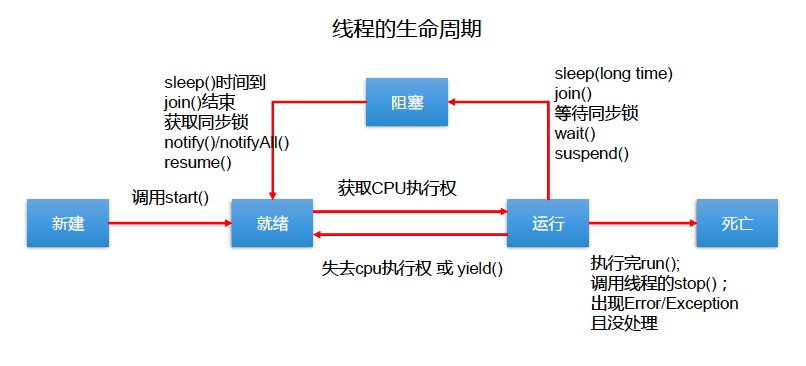

# 线程

## 线程创建

### 继承Thread类
Thread构造器  
* Tread() 创建新的Thread对象
* Thread(String threadName) 创建线程并指定线程的实例名
* Thread(Runnable target) 指定创建线程的目标对象，它实现了 Runnable 接口中的 run 方法
* Thread(Runnable target, String name) 创建新的Thread对象
常用方法  
* void start(): 启动线程，并执行对象的 run() 方法
* run(): 线程在被调度时执行的操作
* String getName (): 返回线程的名称
* void setName (String name) 设置该线程名称
* static Thread currentThread (): 返回当前线程。在 Thread 子类中就是 this，通常用于主线程和 Runnable 实现类
* static void yield() 线程让步
    > 暂停当前正在执行的线程，把执行机会让给优先级相同或更高的线程  
    > 若队列中没有同优先级的线程，忽略此方法  
* join() 当某个程序执行流中调用其他线程的 join() 方法时 调用线程 将被阻塞，直到 join() 方法加入的 join 线程执行完为止
    > 低优先级的线程也可以获得执行  
* static void sleep(long millis 指定时间 毫秒
    > 令当前活动线程在指定时间段内放弃对 CPU 控制 使其他线程有机会被执行 时间到后重排队    
    > 抛出 InterruptedException 异常  
* stop(): 强制线程生命期结束，不推荐使用
* boolean isAlive 返回 boolean ，判断线程是否还活着

```java
class MyTread extends Thread {
    @Override
    public void run() {
        for (int i = 0; i < 100; i++) {
            System.out.println(Thread.currentThread().getName() + i);
        }
    }
}
```

### 实现Runnable接口
```java
class HelloThread implements Runnable{
    @Override
    public void run() {
        System.out.println("hello thread");
    }
}
```

### 区别
* 区别
    > 继承 Thread ：线程代码存放 Thread 子类 run 方法中。
    > 实现 Runnable ：线程代码存在接口的子类的 run 方法。
* 实现方式的好处
    > 避免了单继承的局限性
    > 多个线程可以共享同一个接口实现的对象，非常适合多个相同线程来处理同一份资源
        
### 实现Callable接口
参考juc 中的callable

### 线程池
参考juc 中的线程池

## 线程调度
调度策略  
* 时间片
* 抢占式:高优先级的线程抢占cpu  

Java调度方法
* 同优先级线程组成先进先出队列,使用时间片策略
* 高优先级,使用优先调度的抢占策略  

线程的优先级  
* MAX_PRIORITY 10
* MIN PRIORITY 1
* NORM_PRIORITY 5  

方法 
* getPriority() 返回优先级
* setPriority(int newPriority) 设置优先级  

注意:
* 线程创建时继承父线程 的 优先级
* 低优先级只是获得调度的概率低，并非一定是在高优先级线程之后才被调用

## 线程的分类
Java中的线程分为两类：一种是 守护线程 ，一种是 用户线程 。
* 它们在几乎每个方面都是相同的，唯一的区别是判断 JVM 何时离开。
* 守护线程是用来服务用户线程的，通过在 start() 方法前调用thread.setDaemon (true) 可以把一个用户线程变成一个守护线程。
* Java 垃圾回收就是一个典型的守护线程。
* 若 JVM 中都是守护线程，当前 JVM 将 退出 。

## 生命周期
JDK 中用 Thread State 类定义了线程的几种状态  
要想实现多线程,必须在主线程中创建新的线程对象.Java 语言使用 Thread 类及其子类的对象来表示线程,在它的一个完整的生命周期中通常要经历如下的 五种状态

* 新建： 当 一个 Thread 类或其子类的对象被声明并创建时，新生的线程对象处于新建状态
* 就绪： 处于 新建 状态的线程被 start() 后，将进入线程队列等待 CPU 时间片，此时它已具备了运行的条件，只是没分配到 CPU 资源
* 运行： 当就绪的线程被调度并获得 CPU 资源时便进入运行状态， run() 方法定义了线程的操作和功能
* 阻塞： 在某种特殊情况下，被人为挂起或执行输入输出操作时，让出 CPU 并临时中止自己的执行，进入阻塞状态
* 死亡： 线程完成了它的全部工作或线程被提前强制性地中止或出现异常导致结束

 


