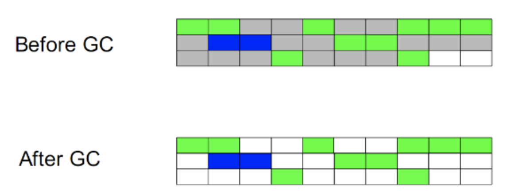
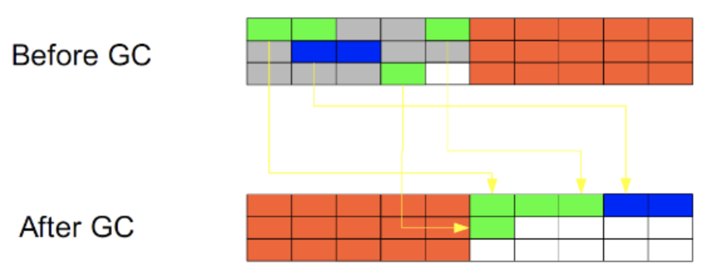

# jvm

## 一些概念

### 数据类型
- 基本类型
  代表的值就是数值本身  
  包括: byte,short,int,long,char,float,double,Boolean,returnAddress
- 引用类型
  保存"引用值",引用值代表了某个对象的引用,而不是对象本身,对象本身存放在这个引用值所表示的地址的位置  
  包括: 类类型,接口类型和数组

### 堆(heap)与栈(stack)
- 栈是运行时的单位, 堆是存储的单位
  栈解决程序的运行问题,即程序如何运行,或者说如何处理数据; 堆解决的是数据存储的问题,即数据怎么放,放在哪儿
  在java中一个线程就会相应有一个线程栈与之对应,这点很容易理解,因为不同的线程执行逻辑有所不同,因此需要一个独立的线程栈.
  而堆则是所有线程共享的.
  栈因为是运行单位,因此里面存储的信息都是跟当前线程相关的信息.包括局部变量,程序运行状态,方法返回值等;而堆只负责存储对象信息.
- 为何要区分堆和栈
  一.栈代表了处理逻辑,堆代表了数据,分而治之;  
  二.这样堆中的数据可以被多个栈共享;
  三.栈因为运行时的需要，比如保存系统运行的上下文，需要进行地址段的划分。由于栈只能向上增长，因此就会限制住栈存储内容的能力。而堆不同，堆中的对象是可以根据需要动态增长的，因此栈和堆的拆分，使得动态增长成为可能，相应栈中只需记录堆中的一个地址即可
  四.面向对象就是堆和栈的完美结合。其实，面向对象方式的程序与以前结构化的程序在执行上没有任何区别。但是，面向对象的引入，使得对待问题的思考方式发生了改变，而更接近于自然方式的思考。当我们把对象拆开，你会发现，对象的属性其实就是数据，存放在堆中；而对象的行为（方法），就是运行逻辑，放在栈中。我们在编写对象的时候，其实即编写了数据结构，也编写的处理数据的逻辑。不得不承认，面向对象的设计，确实很美
- java中,main函数就是栈的起点,也是程序的起点
- 堆中存什么? 栈中存什么?
  堆中存的是对象。栈中存的是基本数据类型和堆中对象的引用  
  一个对象的大小是不可估计的，或者说是可以动态变化的，但是在栈中，一个对象只对应了一个4btye的引用（堆栈分离的好处：））。
  为什么不把基本类型放堆中呢？因为其占用的空间一般是1~8个字节——需要空间比较少，而且因为是基本类型，所以不会出现动态增长的情况——长度固定，因此栈中存储就够了，如果把他存在堆中是没有什么意义的（还会浪费空间，后面说明）。可以这么说，基本类型和对象的引用都是存放在栈中，而且都是几个字节的一个数，因此在程序运行时，他们的处理方式是统一的。但是基本类型、对象引用和对象本身就有所区别了，因为一个是栈中的数据一个是堆中的数据。最常见的一个问题就是，Java中参数
- java中参数传递是传值?还是传引用?
  不要试图与c类比,java中没有指针的概念;  
  程序运行永远都是在栈中进行的,因而参数传递时,只存在传递基本类型和对象引用的问题.不会直接传对象本身;  
  堆和栈中，栈是程序运行最根本的东西。程序运行可以没有堆，但是不能没有栈。而堆是为栈进行数据存储服务，说白了堆就是一块共享的内存。不过，正是因为堆和栈的分离的思想，才使得Java的垃圾回收成为可能  
  Java中，栈的大小通过-Xss来设置，当栈中存储数据比较多时，需要适当调大这个值，否则会出现java.lang.StackOverflowError异常。常见的出现这个异常的是无法返回的递归，因为此时栈中保存的信息都是方法返回的记录点

### java对象的大小 
java中,一个空Object对象的大小是8byte,这个大小只是保存堆中一个没有任何属性的对象的大小;  
`Object obj = new Object()` 它所点的空间为: 4byte+8byte. 4byte是java栈中保存引用所需要的空间.8byte是java堆中对象的信息.  
Java在对对象内存分配时都是以8的整数倍来分

### 引用类型
强引用,软引用,弱引用和虚引用  
- 强引用: 就是我们一般声明对象时虚拟机生成的引用，强引用环境下，垃圾回收时需要严格判断当前对象是否被强引用，如果被强引用，则不会被垃圾回收
- 软引用: 软引用一般被做为缓存来使用。与强引用的区别是，软引用在垃圾回收时，虚拟机会根据当前系统的剩余内存来决定是否对软引用进行回收。如果剩余内存比较紧张，则虚拟机会回收软引用所引用的空间；如果剩余内存相对富裕，则不会进行回收。换句话说，虚拟机在发生OutOfMemory时，肯定是没有软引用存在的
- 弱引用: 弱引用与软引用类似，都是作为缓存来使用。但与软引用不同，弱引用在进行垃圾回收时，是一定会被回收掉的，因此其生命周期只存在于一个垃圾回收周期内

## 基本垃圾回收算法

### 按照基本回收策略分
#### 引用计数(Reference Counting)
比较古老的算法.原理是此对象有一个引用,即增加一个计数,删除一个引用则减少一个计数.垃圾回收时,只用收集计数为0的对象.此算法最致命的是无法处理循环引用的问题.
#### 标记-清除(Mark-Sweep)
此算法分两阶段.第一阶段从引用根节点开始标记所有被引用的对象,第二阶段遍历整个堆,把未标记的对象清除. 此算法需要暂停整个应用,同时会产生内存碎片

#### 复制(Copying)
此算法把内存空间划分为两个相待的区域,每次只使用其中一个区域.垃圾回收时,遍历当前使用区域,把正在使用中的对象复制到另外一个区域中.  
此算法每次只处理正在使用中的对象,因此复制成本比较小,同时复制过去以后还能进行相应的内存整理,不会出现碎片问题.  
当然,此算法缺点也是明显的, 就是需要两倍的内存空间

#### 标记-整理(Mark-Compact)
此算法结合了"标记-清除"和"复制"两个算法的优点.也是分两阶段,  
第一阶段从根节点开始标记所有被引用对象;  
第二阶段遍历整个堆,清除未标记对象并且把存活对象"压缩"到堆的其中一块,按顺序排放.  
此算法避免了"标记-清除"的碎片问题,同时也避免了"复制"算法的空间问题

### 按分区对待的方式分
#### 增量收集
实时垃圾回收算法,即:在应用进行的同时进行垃圾回收.jdk5中没有使用这种算法
#### 分代收集
基于对对象生命周期分析后得出的垃圾回收算法.  
把对象分为: 青年代,老年代,持久代  
对不同生命周期使用不同的算法进行回收.现在的垃圾回收器都是使用此算法

### 按系统线程分
#### 串行收集
串行收集使用单线程处理所有垃圾回收工作, 因为无需多线程交互,实现容易,而且效率比较高. 但是,其局限性也比较明显,即无法使用多处理器的优势,所以此收集适合单处理器机器.当然,此收集器也可以用在小数据量(100M)情况下的多处理器机器上
#### 并行收集
并行收集使用多线程处理垃圾回收工作,因而速度快,效率高.而且理论上cpu数目越多,越能体现出并行收集器的优势
#### 并发收集
相对于串行收集和并行收集而言,前面两个在进行垃圾回收工作时, 需要暂停整个运行环境,而只有垃圾回收程序在运行,因此,系统在垃圾回收时会有明显的暂停,而且暂停时间会因为堆越大而越长

## 垃圾回收面临的问题

### 如何区分垃圾
上面分析的堆和栈的区别，其中栈是真正进行程序执行地方，所以要获取哪些对象正在被使用，则需要从Java栈开始。同时，一个栈是与一个线程对应的，因此，如果有多个线程的话，则必须对这些线程对应的所有的栈进行检查  
同时，除了栈外，还有系统运行时的寄存器等，也是存储程序运行数据的  

以栈或寄存器中的引用为起点，我们可以找到堆中的对象，又从这些对象找到对堆中其他对象的引用，这种引用逐步扩展，最终以null引用或者基本类型结束，这样就形成了一颗以Java栈中引用所对应的对象为根节点的一颗对象树，如果栈中有多个引用，则最终会形成多颗对象树。在这些对象树上的对象，都是当前系统运行所需要的对象，不能被垃圾回收。而其他剩余对象，则可以视为无法被引用到的对象，可以被当做垃圾进行回收

因此，垃圾回收的起点是一些根对象（java栈, 静态变量, 寄存器...）。而最简单的Java栈就是Java程序执行的main函数。这种回收方式，也是上面提到的“标记-清除”的回收方式

### 如何处理碎片
由于不同Java对象存活时间是不一定的，因此，在程序运行一段时间以后，如果不进行内存整理，就会出现零散的内存碎片。碎片最直接的问题就是会导致无法分配大块的内存空间，以及程序运行效率降低。所以，在上面提到的基本垃圾回收算法中，“复制”方式和“标记-整理”方式，都可以解决碎片的问题

### 如何解决同时存在的对象创建和对象回收问题
垃圾回收线程是回收内存的，而程序运行线程则是消耗（或分配）内存的，**一个回收内存，一个分配内存**，从这点看，两者是矛盾的。因此，在现有的垃圾回收方式中，要进行垃圾回收前，一般都需要暂停整个应用（即：暂停内存的分配），然后进行垃圾回收，回收完成后再继续应用。这种实现方式是最直接，而且最有效的解决二者矛盾的方式

但是**这种方式有一个很明显的弊端，就是当堆空间持续增大时，垃圾回收的时间也将会相应的持续增大，对应应用暂停的时间也会相应的增大**。一些对相应时间要求很高的应用，比如最大暂停时间要求是几百毫秒，那么当堆空间大于几个G时，就很有可能超过这个限制，在这种情况下，垃圾回收将会成为系统运行的一个瓶颈。为解决这种矛盾，有了**并发垃圾回收算法**，使用这种算法，垃圾回收线程与程序运行线程同时运行。在这种方式下，解决了暂停的问题，但是因为需要在新生成对象的同时又要回收对象，算法复杂性会大大增加，系统的处理能力也会相应降低，同时，“碎片”问题将会比较难解决

## 分代垃圾回收

