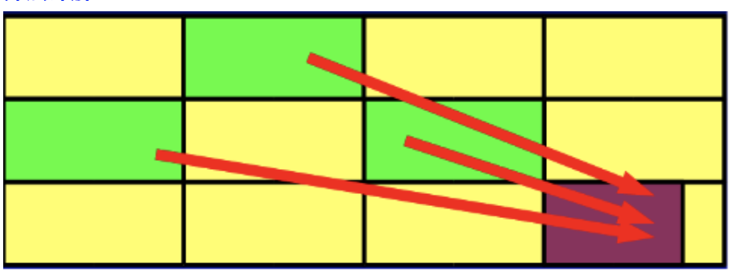
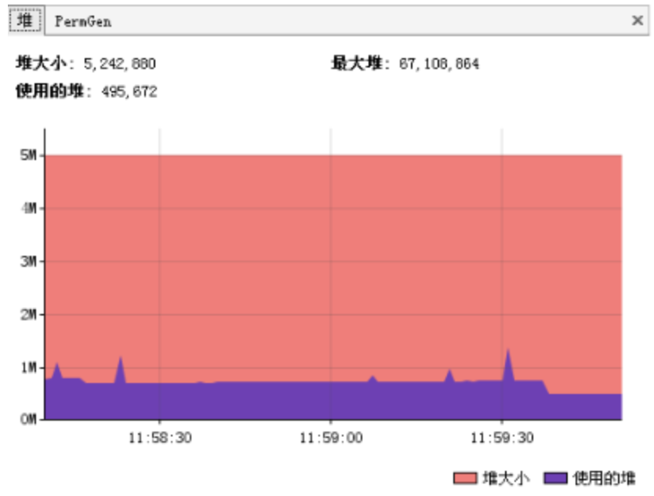
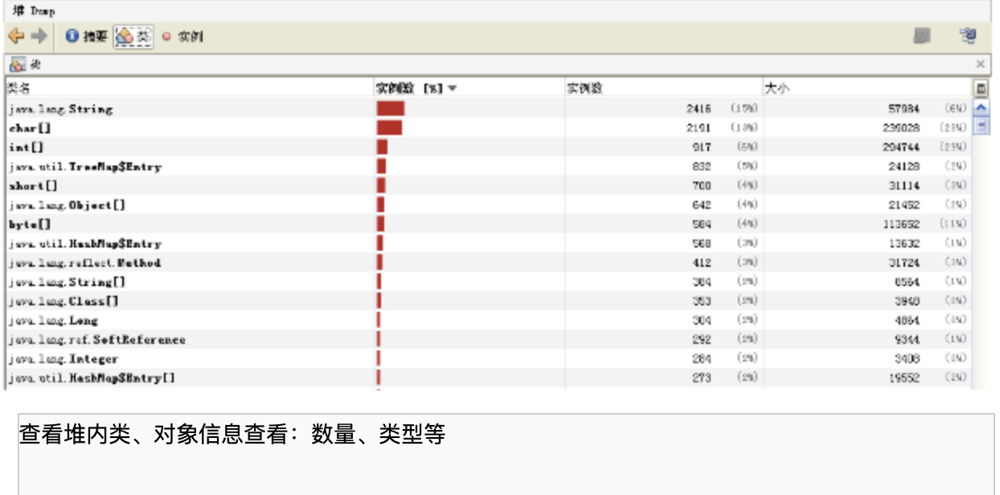
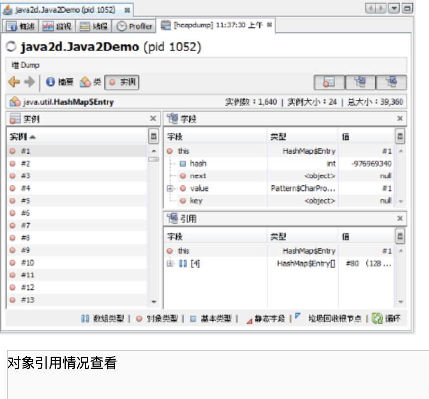
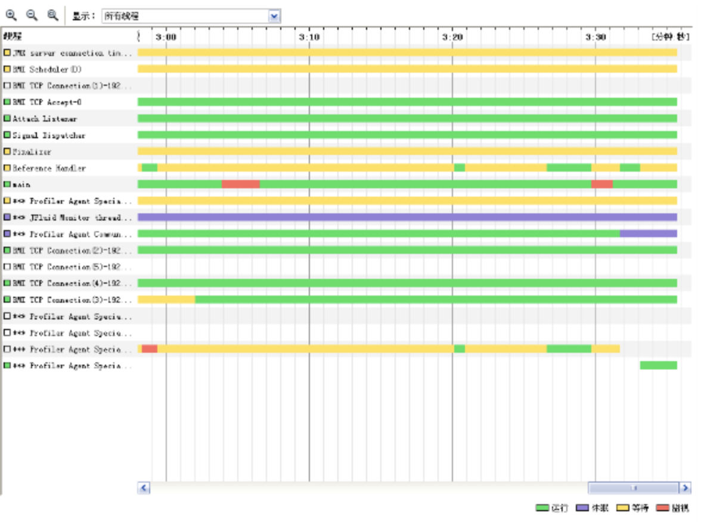
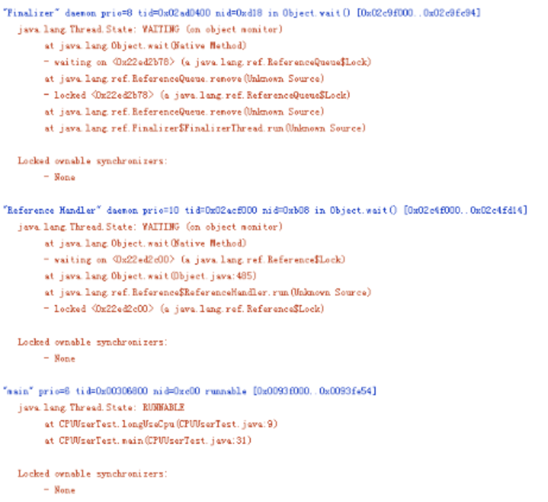
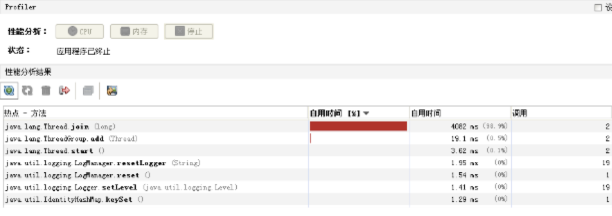

# jvm

## 新一代垃圾回收算法
### 垃圾回收的瓶颈
  传统分代垃圾回收方式，已经在一定程度上把垃圾回收给应用带来的负担降到了最小，把应用的吞吐量推到了一个极限。但是他无法解决的一个问题，就是Full GC所带来的应用暂停。在一些对实时性要求很高的应用场景下，GC暂停所带来的请求堆积和请求失败是无法接受的。这类应用可能要求请求的返回时间在几百甚至几十毫秒以内，如果分代垃圾回收方式要达到这个指标，只能把最大堆的设置限制在一个相对较小范围内，但是这样有限制了应用本身的处理能力，同样也是不可接收的。

  分代垃圾回收方式确实也考虑了实时性要求而提供了并发回收器，支持最大暂停时间的设置，但是受限于分代垃圾回收的内存划分模型，其效果也不是很理想。

  为了达到实时性的要求（其实Java语言最初的设计也是在嵌入式系统上的），一种新垃圾回收方式呼之欲出，它既支持短的暂停时间，又支持大的内存空间分配。可以很好的解决传统分代方式带来的问题。
### 增量收集的演进
  增量收集的方式在理论上可以解决传统分代方式带来的问题。增量收集把对堆空间划分成一系列内存块，使用时，先使用其中一部分（不会全部用完），垃圾收集时把之前用掉的部分中的存活对象再放到后面没有用的空间中，这样可以实现一直边使用边收集的效果，避免了传统分代方式整个使用完了再暂停的回收的情况。

  当然，传统分代收集方式也提供了并发收集，但是他有一个很致命的地方，就是把整个堆做为一个内存块，这样一方面会造成碎片（无法压缩），另一方面他的每次收集都是对整个堆的收集，无法进行选择，在暂停时间的控制上还是很弱。而增量方式，通过内存空间的分块，恰恰可以解决上面问题。

### Garbage First(G1)
#### 目标
从设计目标看G1完全是为了大型应用而准备的
```
持很大的堆

高吞吐量

  --支持多CPU和垃圾回收线程

  --在主线程暂停的情况下，使用并行收集

  --在主线程运行的情况下，使用并发收集

实时目标：可配置在N毫秒内最多只占用M毫秒的时间进行垃圾回收
```

#### 算法详解
[G1算法](http://www.blogjava.net/BlueDavy/archive/2009/03/11/259230.html)

G1可谓博采众家之长，力求到达一种完美。他吸取了增量收集优点，把整个堆划分为一个一个等大小的区域（region）。内存的回收和划分都以region为单位；同时，他也吸取了CMS的特点，把这个垃圾回收过程分为几个阶段，分散一个垃圾回收过程；而且，G1也认同分代垃圾回收的思想，认为不同对象的生命周期不同，可以采取不同收集方式，因此，它也支持分代的垃圾回收。为了达到对回收时间的可预计性，G1在扫描了region以后，对其中的活跃对象的大小进行排序，首先会收集那些活跃对象小的region，以便快速回收空间（要复制的活跃对象少了），因为活跃对象小，里面可以认为多数都是垃圾，所以这种方式被称为Garbage First（G1）的垃圾回收算法，即：垃圾优先的回收。

回收步骤:
* 初始标记 initial marking
  G1对于每个region都保存了两个标识用的bitmap，一个为previous marking bitmap，一个为next marking bitmap，bitmap中包含了一个bit的地址信息来指向对象的起始点。

  开始Initial Marking之前，首先并发的清空next marking bitmap，然后停止所有应用线程，并扫描标识出每个region中root可直接访问到的对象，将region中top的值放入next top at mark start（TAMS）中，之后恢复所有应用线程。

  触发这个步骤执行的条件为：
  ```
  G1定义了一个JVM Heap大小的百分比的阀值，称为h，另外还有一个H，H的值为(1-h)*Heap Size，目前这个h的值是固定的，后续G1也许会将其改为动态的，根据jvm的运行情况来动态的调整，在分代方式下，G1还定义了一个u以及soft limit，soft limit的值为H-u*Heap Size，当Heap中使用的内存超过了soft limit值时，就会在一次clean up执行完毕后在应用允许的GC暂停时间范围内尽快的执行此步骤；

  在pure方式下，G1将marking与clean up组成一个环，以便clean up能充分的使用marking的信息，当clean up开始回收时，首先回收能够带来最多内存空间的regions，当经过多次的clean up，回收到没多少空间的regions时，G1重新初始化一个新的marking与clean up构成的环。
  ```
* 并发标记 concurrent marking
  按照之前Initial Marking扫描到的对象进行遍历，以识别这些对象的下层对象的活跃状态，对于在此期间应用线程并发修改的对象的依赖关系则记录到remembered set logs中，新创建的对象则放入比top值更高的地址区间中，这些新创建的对象默认状态即为活跃的，同时修改top值。
* 最终标记暂停 final marking pause
  当应用线程的remembered set logs未满时，是不会放入filled RS buffers中的，在这样的情况下，这些remebered set logs中记录的card的修改就会被更新了，因此需要这一步，这一步要做的就是把应用线程中存在的remembered set logs的内容进行处理，并相应的修改remembered sets，这一步需要暂停应用，并行的运行
* 存活对象计算及清除 live data counting and cleanup
  值得注意的是，在G1中，并不是说Final Marking Pause执行完了，就肯定执行Cleanup这步的，由于这步需要暂停应用，G1为了能够达到准实时的要求，需要根据用户指定的最大的GC造成的暂停时间来合理的规划什么时候执行Cleanup，另外还有几种情况也是会触发这个步骤的执行的：
  ```
  G1采用的是复制方法来进行收集，必须保证每次的”to space”的空间都是够的，因此G1采取的策略是当已经使用的内存空间达到了H时，就执行Cleanup这个步骤；

  对于full-young和partially-young的分代模式的G1而言，则还有情况会触发Cleanup的执行，full-young模式下，G1根据应用可接受的暂停时间、回收young regions需要消耗的时间来估算出一个yound regions的数量值，当JVM中分配对象的young regions的数量达到此值时，Cleanup就会执行；partially-young模式下，则会尽量频繁的在应用可接受的暂停时间范围内执行Cleanup，并最大限度的去执行non-young regions的Cleanup。
  ```

## 调优方法
### jvm调优工具
Jconsole : jdk自带，功能简单，但是可以在系统有一定负荷的情况下使用。对垃圾回收算法有很详细的跟踪。详细说明参考这里

JProfiler：商业软件，需要付费。功能强大。详细说明参考这里

VisualVM：JDK自带，功能强大，与JProfiler类似。推荐。

### 如何调优
观察内存释放情况、集合类检查、对象树

上面这些调优工具都提供了强大的功能，但是总的来说一般分为以下几类功能
#### 堆信息查看

```
可查看堆空间大小分配（年轻代、年老代、持久代分配）

提供即时的垃圾回收功能

垃圾监控（长时间监控回收情况）
```



有了堆信息查看方面的功能，我们一般可以顺利解决以下问题：
  - 年老代年轻代大小划分是否合理
  - 内存泄漏
  - 垃圾回收算法设置是否合理

### 线程监控

```
线程信息监控：系统线程数量。

线程状态监控：各个线程都处在什么样的状态下
```


```
Dump线程详细信息：查看线程内部运行情况

死锁检查
```

#### 热点分析

CPU热点：检查系统哪些方法占用的大量CPU时间

内存热点：检查哪些对象在系统中数量最大（一定时间内存活对象和销毁对象一起统计）

这两个东西对于系统优化很有帮助。我们可以根据找到的热点，有针对性的进行系统的瓶颈查找和进行系统优化，而不是漫无目的的进行所有代码的优化

#### 快照
快照是系统运行到某一时刻的一个定格。在我们进行调优的时候，不可能用眼睛去跟踪所有系统变化，依赖快照功能，我们就可以进行系统两个不同运行时刻，对象（或类、线程等）的不同，以便快速找到问题

举例说，我要检查系统进行垃圾回收以后，是否还有该收回的对象被遗漏下来的了。那么，我可以在进行垃圾回收前后，分别进行一次堆情况的快照，然后对比两次快照的对象情况。

### 内存泄露检查
内存泄漏是比较常见的问题，而且解决方法也比较通用，这里可以重点说一下，而线程、热点方面的问题则是具体问题具体分析了。

内存泄漏一般可以理解为系统资源（各方面的资源，堆、栈、线程等）在错误使用的情况下，导致使用完毕的资源无法回收（或没有回收），从而导致新的资源分配请求无法完成，引起系统错误。

内存泄漏对系统危害比较大，因为他可以直接导致系统的崩溃。

需要区别一下，内存泄漏和系统超负荷两者是有区别的，虽然可能导致的最终结果是一样的。内存泄漏是用完的资源没有回收引起错误，而系统超负荷则是系统确实没有那么多资源可以分配了（其他的资源都在使用）

#### 年老代堆空间被占满
异常： java.lang.OutOfMemoryError: Java heap space

说明：
    

这是最典型的内存泄漏方式，简单说就是所有堆空间都被无法回收的垃圾对象占满，虚拟机无法再在分配新空间。

    如上图所示，这是非常典型的内存泄漏的垃圾回收情况图。所有峰值部分都是一次垃圾回收点，所有谷底部分表示是一次垃圾回收后剩余的内存。连接所有谷底的点，可以发现一条由底到高的线，这说明，随时间的推移，系统的堆空间被不断占满，最终会占满整个堆空间。因此可以初步认为系统内部可能有内存泄漏。（上面的图仅供示例，在实际情况下收集数据的时间需要更长，比如几个小时或者几天）

解决：

    这种方式解决起来也比较容易，一般就是根据垃圾回收前后情况对比，同时根据对象引用情况（常见的集合对象引用）分析，基本都可以找到泄漏点。

#### 持久代被占满
异常：java.lang.OutOfMemoryError: PermGen space

说明：

    Perm空间被占满。无法为新的class分配存储空间而引发的异常。这个异常以前是没有的，但是在Java反射大量使用的今天这个异常比较常见了。主要原因就是大量动态反射生成的类不断被加载，最终导致Perm区被占满。

    更可怕的是，不同的classLoader即便使用了相同的类，但是都会对其进行加载，相当于同一个东西，如果有N个classLoader那么他将会被加载N次。因此，某些情况下，这个问题基本视为无解。当然，存在大量classLoader和大量反射类的情况其实也不多。

解决：

    1. -XX:MaxPermSize=16m

    2. 换用JDK。比如JRocket

#### 堆栈溢出
异常：java.lang.StackOverflowError

说明：这个就不多说了，一般就是递归没返回，或者循环调用造成

#### 线程堆栈满
异常：Fatal: Stack size too small

说明：java中一个线程的空间大小是有限制的。JDK5.0以后这个值是1M。与这个线程相关的数据将会保存在其中。但是当线程空间满了以后，将会出现上面异常。

解决：增加线程栈大小。-Xss2m。但这个配置无法解决根本问题，还要看代码部分是否有造成泄漏的部分

#### 系统内存被占用
异常：java.lang.OutOfMemoryError: unable to create new native thread

说明：

    这个异常是由于操作系统没有足够的资源来产生这个线程造成的。系统创建线程时，除了要在Java堆中分配内存外，操作系统本身也需要分配资源来创建线程。因此，当线程数量大到一定程度以后，堆中或许还有空间，但是操作系统分配不出资源来了，就出现这个异常了。

分配给Java虚拟机的内存愈多，系统剩余的资源就越少，因此，当系统内存固定时，分配给Java虚拟机的内存越多，那么，系统总共能够产生的线程也就越少，两者成反比的关系。同时，可以通过修改-Xss来减少分配给单个线程的空间，也可以增加系统总共内生产的线程数。

解决：

    1. 重新设计系统减少线程数量。

    2. 线程数量不能减少的情况下，通过-Xss减小单个线程大小。以便能生产更多的线程。

## 反思
### 垃圾回收的悖论
所谓“成也萧何败萧何”。Java的垃圾回收确实带来了很多好处，为开发带来了便利。但是在一些高性能、高并发的情况下，垃圾回收确成为了制约Java应用的瓶颈。目前JDK的垃圾回收算法，始终无法解决垃圾回收时的暂停问题，因为这个暂停严重影响了程序的相应时间，造成拥塞或堆积。这也是后续JDK增加G1算法的一个重要原因。

当然，上面是从技术角度出发解决垃圾回收带来的问题，但是从系统设计方面我们就需要问一下了：
    ```
    我们需要分配如此大的内存空间给应用吗？

    我们是否能够通过有效使用内存而不是通过扩大内存的方式来设计我们的系统呢？ 
    ```

### 我们的内存中都放了什么
内存中需要放什么呢？个人认为，内存中需要放的是你的应用需要在不久的将来再次用到到的东西。想想看，如果你在将来不用这些东西，何必放内存呢？放文件、数据库不是更好？这些东西一般包括：
    ```
    1. 系统运行时业务相关的数据。比如web应用中的session、即时消息的session等。这些数据一般在一个用户访问周期或者一个使用过程中都需要存在。

    1. 缓存。缓存就比较多了，你所要快速访问的都可以放这里面。其实上面的业务数据也可以理解为一种缓存。

    2.  线程。
    ```
因此，我们是不是可以这么认为，如果我们不把业务数据和缓存放在JVM中，或者把他们独立出来，那么Java应用使用时所需的内存将会大大减少，同时垃圾回收时间也会相应减少。

    我认为这是可能的。

### 解决之道
#### 数据库,文件系统
把所有数据都放入数据库或者文件系统，这是一种最为简单的方式。在这种方式下，Java应用的内存基本上等于处理一次峰值并发请求所需的内存。数据的获取都在每次请求时从数据库和文件系统中获取。也可以理解为，一次业务访问以后，所有对象都可以进行回收了。

这是一种内存使用最有效的方式，但是从应用角度来说，这种方式很低效。

#### 内存-硬盘映射
上面的问题是因为我们使用了文件系统带来了低效。但是如果我们不是读写硬盘，而是写内存的话效率将会提高很多。

数据库和文件系统都是实实在在进行了持久化，但是当我们并不需要这样持久化的时候，我们可以做一些变通——把内存当硬盘使。

内存-硬盘映射很好很强大，既用了缓存又对Java应用的内存使用又没有影响。Java应用还是Java应用，他只知道读写的还是文件，但是实际上是内存。

这种方式兼得的Java应用与缓存两方面的好处。memcached的广泛使用也正是这一类的代表。

#### 同一机器部署多个jvm
这也是一种很好的方式，可以分为纵拆和横拆。纵拆可以理解为把Java应用划分为不同模块，各个模块使用一个独立的Java进程。而横拆则是同样功能的应用部署多个JVM。

通过部署多个JVM，可以把每个JVM的内存控制一个垃圾回收可以忍受的范围内即可。但是这相当于进行了分布式的处理，其额外带来的复杂性也是需要评估的。另外，也有支持分布式的这种JVM可以考虑，不过要钱哦：）

#### 程序控制的对象生命周期
这种方式是理想当中的方式，目前的虚拟机还没有，纯属假设。即：考虑由编程方式配置哪些对象在垃圾收集过程中可以直接跳过，减少垃圾回收线程遍历标记的时间。

这种方式相当于在编程的时候告诉虚拟机某些对象你可以在*时间后在进行收集或者由代码标识可以收集了（类似C、C++），在这之前你即便去遍历他也是没有效果的，他肯定是还在被引用的。

这种方式如果JVM可以实现，个人认为将是一个飞跃，Java即有了垃圾回收的优势，又有了C、C++对内存的可控性。

#### 线程分配
Java的阻塞式的线程模型基本上可以抛弃了，目前成熟的NIO框架也比较多了。阻塞式IO带来的问题是线程数量的线性增长，而NIO则可以转换成为常数线程。因此，对于服务端的应用而言，NIO还是唯一选择。不过，JDK7中为我们带来的AIO是否能让人眼前一亮呢？我们拭目以待。

#### 其他的jdk
本文说的都是Sun的JDK，目前常见的JDK还有JRocket和IBM的JDK。其中JRocket在IO方面比Sun的高很多，不过Sun JDK6.0以后提高也很大。而且JRocket在垃圾回收方面，也具有优势，其可设置垃圾回收的最大暂停时间也是很吸引人的。不过，系统Sun的G1实现以后，在这方面会有一个质的飞跃。